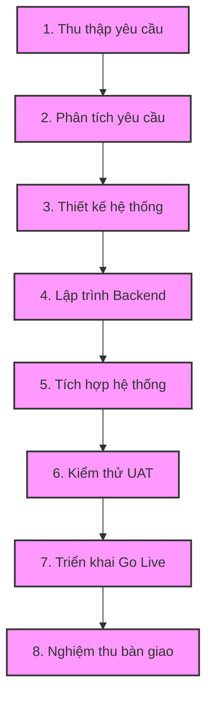

# KẾ HOẠCH PHÁT TRIỂN PHẦN MỀM (SDP)
## HỆ THỐNG ĐĂNG KÝ HỌC PHẦN TRỰC TUYẾN

| Thông tin tài liệu | Chi tiết (Theo mẫu Project Plan.docx / HSU SDP) |
| :--- | :--- |
| **Dự án** | Cổng Đăng ký Học phần Trực tuyến HSU |
| **Tài liệu** | Kế hoạch Phát triển Phần mềm (Software Development Plan - SDP) |
| **Phiên bản** | v1.0 |
| **Ngày lập** | 23/07/2026 |
| **Trạng thái** | Baseline |
| **Tác giả** | Nhóm 3 (Lớp SW403DE01) |
| **Người duyệt** | Thầy Nguyễn Văn Sơn |

---

### LỊCH SỬ THAY ĐỔI TÀI LIỆU (REVISION HISTORY)

| Ngày | Phiên bản | Mô tả chi tiết thay đổi | Tác giả |
| :--- | :--- | :--- | :--- |
| 12/07/2026 | v0.1 | Khởi tạo cấu trúc SDP, mục tiêu và phạm vi | Võ Duy Bình |
| 16/07/2026 | v0.5 | Xây dựng WBS, Gantt Chart tiến độ và tài liệu thiết kế hệ thống | Trần Bá Lợi, Nguyễn Thanh Quang |
| 20/07/2026 | v0.8 | Tích hợp thuật toán CPM đường găng, kế hoạch rủi ro và QA | Hồng Bảo Khang |
| 23/07/2026 | v1.0 | Đồng bộ hóa code thực tế, giao diện dashboard và hoàn tất Baseline | Nhóm 3 |

---

### THÔNG TIN NHÓM THỰC HIỆN

* **Môn học:** Quản trị dự án phần mềm (SW403DE01)
* **Trường:** Đại học Hoa Sen (HSU)
* **Nhóm thực hiện:** Nhóm 3
* **Thành viên:**
  * Võ Duy Bình - MSSV: 22301500 (Nhóm trưởng)
  * Hồng Bảo Khang - MSSV: 22101347
  * Trần Bá Lợi - MSSV: 22300236
  * Nguyễn Thanh Quang - MSSV: 22110739
* **Giảng viên hướng dẫn:** Thầy Nguyễn Văn Sơn

---

## MỤC LỤC
1. [Giới thiệu dự án](#1-giới-thiệu-dự-án)
2. [Mục tiêu dự án](#2-mục-tiêu-dự-án)
3. [Phạm vi dự án](#3-phạm-vi-dự-án)
4. [Các bên liên quan (Stakeholders)](#4-các-bên-liên-quan-stakeholders)
5. [Đặc tả chức năng hệ thống](#5-các-chức-năng-hệ-thống)
6. [Cấu trúc phân rã công việc (WBS)](#6-work-breakdown-structure-wbs)
7. [Quản lý tiến độ (Schedule Management)](#7-quản-lý-tiến-độ-schedule-management)
8. [Biểu đồ Gantt (Gantt Chart)](#8-gantt-chart)
9. [Các mốc quan trọng (Milestones)](#9-milestones)
10. [Đường găng dự án (Critical Path)](#10-critical-path-đường-găng)
11. [Kế hoạch quản trị rủi ro tiến độ](#11-quản-lý-rủi-ro-ảnh-hưởng-đến-tiến-độ)
12. [Công cụ quản lý dự án](#12-công-cụ-quản-lý-tiến-độ)
13. [Kết quả mong đợi](#13-kết-quả-mong-đợi)

---

## 1. Giới thiệu dự án

### Tên dự án
Xây dựng hệ thống đăng ký học phần trực tuyến (Online Course Registration System).

### Mô tả bối cảnh và lý do thực hiện
Hiện nay, nhiều trường đại học vẫn sử dụng quy trình đăng ký học phần bán thủ công hoặc các cổng thông tin cũ có nhiều hạn chế nghiêm trọng. Trong các đợt mở cổng đăng ký học phần, hệ thống thường xuyên gặp các lỗi:
* **Tốc độ xử lý chậm:** Sinh viên mất rất nhiều thời gian tải trang và thực hiện thao tác.
* **Nghẽn mạng/Quá tải hệ thống:** Số lượng sinh viên truy cập đồng thời quá lớn làm sập máy chủ.
* **Thông tin thiếu minh bạch:** Sinh viên khó theo dõi số lượng chỗ còn lại trong các lớp học phần theo thời gian thực.
* **Tốn thời gian điều chỉnh:** Việc thay đổi lịch học, hủy lớp, hoặc xử lý các trường hợp đặc biệt (trùng lịch, nợ môn, môn tiên quyết) tiêu tốn nhiều nhân lực và thời gian của Phòng Đào tạo.

Dự án này nhằm xây dựng một hệ thống đăng ký học phần trực tuyến thế hệ mới giúp sinh viên thực hiện đăng ký nhanh chóng, mượt mà trên môi trường thời gian thực, đồng thời giảm tải áp lực quản lý dữ liệu cho Phòng Đào tạo và đảm bảo toàn bộ công tác chuẩn bị hoàn tất trước khi học kỳ mới bắt đầu.

---

## 2. Mục tiêu dự án

### Các mục tiêu chính của dự án:
1. **Xây dựng ứng dụng Web đăng ký học phần:** Tạo giao diện hiện đại, dễ sử dụng cho sinh viên và Phòng Đào tạo.
2. **Xử lý đăng ký thời gian thực:** Đồng bộ sĩ số lớp học phần tức thời ngay khi sinh viên đăng ký hoặc hủy môn thành công.
3. **Quản lý lớp học phần & Lịch học:** Cho phép Phòng Đào tạo thiết lập thông tin lớp học, lịch học, phòng học một cách linh hoạt.
4. **Kiểm soát ràng buộc tự động (System Rules Validation):**
   * Tự động kiểm tra môn học tiên quyết (Prerequisite check).
   * Tự động kiểm tra trùng lịch học (Schedule clash detection).
   * Giới hạn số lượng sinh viên tối đa của mỗi lớp học phần (Class size limit).
   * Giới hạn số tín chỉ đăng ký tối thiểu và tối đa của sinh viên trong một học kỳ.
5. **Tiến độ và thời gian bàn giao:** Hoàn thành nghiệm thu và sẵn sàng đưa vào vận hành thực tế trước ngày mở cổng đăng ký học kỳ mới của nhà trường.

---

## 3. Phạm vi dự án

### Bao gồm (In-Scope)
* **Phân hệ Đăng nhập:** Xác thực người dùng (Sinh viên, Cán bộ phòng đào tạo).
* **Quản lý Sinh viên:** Lưu trữ thông tin sinh viên, lịch sử học tập (để phục vụ việc kiểm tra môn tiên quyết) và thời khóa biểu cá nhân.
* **Quản lý Học phần & Lớp học phần:** Quản lý danh mục môn học, mã môn học, số tín chỉ, danh sách môn tiên quyết, lịch học chi tiết và sĩ số tối đa.
* **Giao dịch Đăng ký/Hủy học phần:** Cho phép sinh viên đăng ký môn học trực tiếp, cập nhật sĩ số thời gian thực và ghi nhận vào lịch sử giao dịch.
* **Kiểm tra ràng buộc tự động:** Tích hợp bộ kiểm tra trùng lịch học, số tín chỉ tối đa (20 tín chỉ) và kiểm tra điều kiện tiên quyết.
* **Báo cáo và thống kê:** Hỗ trợ Phòng Đào tạo xuất báo cáo sĩ số các lớp học phần và danh sách đăng ký.

### Không bao gồm (Out-of-Scope)
* **Thanh toán học phí:** Việc thu và xử lý học phí sẽ liên kết sang cổng tài chính riêng của nhà trường.
* **Quản lý ký túc xá:** Không thuộc phạm vi của hệ thống đào tạo.
* **Hệ thống quản lý học tập (LMS):** Các hoạt động nộp bài, xem bài giảng sẽ do hệ thống Moodle hoặc Blackboard đảm nhiệm.
* **Thi trực tuyến:** Việc tổ chức kiểm tra và thi trực tuyến không nằm trong phạm vi dự án này.

---

## 4. Các bên liên quan (Stakeholders)

Bảng phân vai và trách nhiệm cụ thể của các Stakeholder trong dự án:

| Vai trò | Đối tượng | Trách nhiệm chính |
| :--- | :--- | :--- |
| **Sponsor** | Ban Giám hiệu | Phê duyệt ngân sách dự án, mục tiêu chiến lược và các mốc bàn giao cốt lõi. |
| **Product Owner** | Phòng Đào tạo | Cung cấp các quy chế học vụ, duyệt yêu cầu tính năng hệ thống và nghiệm thu sản phẩm cuối cùng. |
| **Project Manager** | Trưởng nhóm dự án | Lập kế hoạch, theo dõi tiến độ công việc, quản trị rủi ro và điều phối các nguồn lực nhân sự. |
| **BA (Business Analyst)** | Phân tích yêu cầu | Làm việc với Phòng Đào tạo để chuyển dịch quy chế học vụ thành tài liệu đặc tả chức năng (SRS). |
| **UI/UX Designer** | Thiết kế giao diện | Thiết kế bản phác thảo giao diện (Figma), đảm bảo trải nghiệm đăng ký nhanh và trực quan nhất. |
| **Backend Developer** | Lập trình API | Xây dựng cơ sở dữ liệu, các thuật toán kiểm tra ràng buộc tự động (trùng lịch, môn tiên quyết) và API đăng ký. |
| **Frontend Developer** | Lập trình Website | Phát triển giao diện người dùng dựa trên bản thiết kế, kết nối API và thực hiện luồng tương tác thực tế. |
| **Tester (QC)** | Kiểm thử viên | Thực hiện kiểm thử đơn vị (Unit Test), tích hợp (Integration Test) và kiểm thử hiệu năng tải cao (Load Test). |
| **DevOps Engineer** | Triển khai hạ tầng | Cấu hình máy chủ, thiết lập CI/CD, tối ưu hóa database và duy trì tính ổn định của hệ thống khi chạy thực tế. |
| **Sinh viên** | Người sử dụng | Thực hiện đăng ký học phần, phản hồi ý kiến về giao diện và hiệu năng sử dụng của hệ thống. |
| **Giảng viên** | Người giám sát | Tra cứu danh sách lớp học phần được phân công dạy, theo dõi sĩ số sinh viên đăng ký. |

---

## 5. Đặc tả chức năng hệ thống

Hệ thống được chia thành ba nhóm chức năng chính:

### 5.1. Phân hệ Sinh viên
* **Đăng nhập:** Truy cập hệ thống bằng tài khoản sinh viên.
* **Xem chương trình đào tạo:** Tra cứu các môn học bắt buộc và tự chọn trong chương trình đào tạo của khóa học.
* **Xem danh sách lớp học phần mở:** Hiển thị danh sách các lớp học phần được mở trong học kỳ hiện tại, bao gồm thông tin về giảng viên, lịch học và số chỗ trống.
* **Đăng ký học phần:** Click chọn đăng ký nhanh lớp học phần mong muốn. Hệ thống sẽ ngay lập tức kiểm tra ràng buộc và báo kết quả.
* **Hủy đăng ký học phần:** Cho phép rút tên khỏi lớp học phần đã đăng ký trong thời gian cho phép.
* **Xem thời khóa biểu cá nhân:** Hiển thị lịch học của các môn đã đăng ký thành công dưới dạng lịch tuần trực quan.
* **Xem lịch sử giao dịch:** Ghi lại thời gian đăng ký/hủy đăng ký môn học để đối chiếu khi cần thiết.

### 5.2. Phân hệ Phòng Đào tạo
* **Tạo học kỳ mới:** Thiết lập thời gian bắt đầu và kết thúc của học kỳ mới.
* **Tạo lớp học phần:** Nhập thông tin lịch học, giảng viên, phòng học và sĩ số tối đa cho từng lớp học phần.
* **Mở/Đóng cổng đăng ký:** Điều khiển trạng thái cổng đăng ký học phần theo đúng lịch trình quy định.
* **Quản lý sĩ số lớp học:** Tăng hoặc giảm giới hạn sĩ số của các lớp học phần để đáp ứng nhu cầu thực tế của sinh viên.
* **Xuất báo cáo thống kê:** Xuất danh sách sinh viên đăng ký của từng môn học dưới định dạng Excel để phục vụ lưu trữ và phân lớp học.

### 5.3. Chức năng hệ thống tự động (Core Engine Validation)
* **Kiểm tra điều kiện tiên quyết:** So khớp lịch sử học tập của sinh viên để đảm bảo họ đã hoàn thành các môn học tiên quyết (đạt điểm tích lũy quy định) trước khi đăng ký môn tiếp theo.
* **Kiểm tra trùng lịch học:** Tự động phát hiện nếu thứ/tiết học của lớp học phần mới trùng lặp với bất kỳ lớp nào sinh viên đã đăng ký trước đó.
* **Kiểm tra số tín chỉ giới hạn:** Chỉ cho phép đăng ký tối đa 20 tín chỉ trong một học kỳ thông thường.
* **Kiểm tra sĩ số giới hạn:** Từ chối yêu cầu đăng ký nếu số lượng sinh viên hiện tại của lớp đã đạt ngưỡng sĩ số tối đa.
* **Gửi email xác nhận:** Tự động gửi email thông báo kết quả thời khóa biểu chính thức sau khi cổng đăng ký học phần đóng lại.

---

## 6. Cấu trúc phân rã công việc (WBS)

Dự án được phân rã thành 7 giai đoạn chính với các đầu việc cụ thể:

* **1. Khởi tạo dự án**
  * 1.1 Thu thập yêu cầu từ Phòng Đào tạo.
  * 1.2 Khảo sát các lỗi và hạn chế của hệ thống đăng ký cũ.
  * 1.3 Lập kế hoạch phát triển phần mềm (SDP) và phân bổ ngân sách.
* **2. Phân tích hệ thống**
  * 2.1 Thiết kế biểu đồ Use Case hệ thống.
  * 2.2 Xây dựng sơ đồ mối quan hệ thực thể (ERD).
  * 2.3 Thiết kế cấu trúc cơ sở dữ liệu chi tiết.
  * 2.4 Soạn thảo tài liệu đặc tả yêu cầu phần mềm (SRS).
* **3. Thiết kế giao diện & Kiến trúc**
  * 3.1 Thiết kế giao diện UI (Figma).
  * 3.2 Tối ưu hóa trải nghiệm đăng ký UX (luồng click tối giản).
  * 3.3 Thiết kế kiến trúc chịu tải cao và tích hợp hệ thống.
* **4. Phát triển phần mềm (Coding)**
  * 4.1 Lập trình cơ sở dữ liệu và các Stored Procedure tối ưu hóa luồng xử lý đồng thời.
  * 4.2 Phát triển các API Backend và logic kiểm tra ràng buộc.
  * 4.3 Phát triển giao diện Frontend (Trang đăng ký sinh viên và Dashboard quản trị).
* **5. Kiểm thử chất lượng (Testing)**
  * 5.1 Thực hiện viết Unit Test kiểm thử chức năng lõi.
  * 5.2 Kiểm thử tích hợp hệ thống (Integration Test).
  * 5.3 Kiểm thử chấp nhận người dùng (UAT) với đại diện sinh viên và cán bộ HSU.
* **6. Triển khai**
  * 6.1 Cấu hình máy chủ ứng dụng và máy chủ database (Server Setup).
  * 6.2 Cấu hình tên miền và chứng chỉ bảo mật (SSL/Domain).
  * 6.3 Deploy phiên bản chạy thử và cấu hình dự phòng sự cố.
* **7. Nghiệm thu & Bàn giao**
  * 7.1 Tập huấn sử dụng (Training) cho cán bộ Phòng Đào tạo.
  * 7.2 Bàn giao mã nguồn và tài liệu hướng dẫn vận hành hệ thống.

---

## 7. Quản lý tiến độ (Schedule Management)

Tiến độ dự án kéo dài trong **12 tuần** với các giai đoạn cụ thể:

| Giai đoạn | Tuần thực hiện | Nội dung chi tiết |
| :--- | :--- | :--- |
| **Khởi động** | Tuần 1 | Họp khởi động (Kick-off), thu thập và khảo sát yêu cầu thực tế. |
| **Thu thập yêu cầu** | Tuần 1–2 | Phỏng vấn Phòng Đào tạo, làm rõ các quy chế học vụ và điều kiện tiên quyết. |
| **Phân tích** | Tuần 3 | Hoàn thiện ERD, vẽ sơ đồ dữ liệu và đặc tả SRS. |
| **Thiết kế** | Tuần 4 | Thiết kế Wireframe và Prototype UI/UX trên Figma. |
| **Lập trình Backend** | Tuần 5–7 | Phát triển cơ sở dữ liệu, xây dựng API đăng ký và logic kiểm tra ràng buộc tự động. |
| **Lập trình Frontend** | Tuần 5–7 | Phát triển giao diện Portal Sinh viên, Portal Đào tạo và kết nối API. |
| **Tích hợp** | Tuần 8 | Tích hợp giao diện với API, thiết lập cấu hình chạy thử nghiệm. |
| **Kiểm thử** | Tuần 9 | Thực hiện kiểm thử tính năng và tối ưu hóa tốc độ tải trang. |
| **Sửa lỗi** | Tuần 10 | Fix các lỗi phát sinh từ UAT và tối ưu hóa database. |
| **Triển khai** | Tuần 11 | Deploy lên server chính thức (Go Live) để chuẩn bị cho kỳ đăng ký học phần. |
| **Nghiệm thu** | Tuần 12 | Nghiệm thu dự án, bàn giao mã nguồn, tài liệu hướng dẫn và đóng dự án. |

---

## 8. Biểu đồ Gantt (Gantt Chart)

Bảng phân bổ thời gian thực hiện các đầu việc theo tuần:

```text
Công việc          Tuần: 1   2   3   4   5   6   7   8   9   10  11  12
Khởi động               ██                                             
Thu thập yêu cầu        ██  ██                                         
Phân tích                   ██                                         
Thiết kế                        ██                                     
Backend                             ██  ██  ██                         
Frontend                            ██  ██  ██                         
Database                            ██  ██                             
Integration                                     ██                     
Testing                                             ██                 
Bug Fix                                                 ██             
Deploy                                                      ██         
Nghiệm thu                                                          ██ 
```

---

## 9. Các mốc quan trọng (Milestones)

Các mốc thời gian cốt lõi bắt buộc phải hoàn thành để đảm bảo dự án đúng tiến độ:

* **Mốc 1 (Hoàn thành yêu cầu):** Cuối tuần 2 – Tài liệu SRS được phê duyệt bởi Phòng Đào tạo.
* **Mốc 2 (Hoàn thành thiết kế):** Cuối tuần 4 – Giao diện UI/UX được thông qua.
* **Mốc 3 (Hoàn thành lập trình):** Cuối tuần 7 – Hoàn tất code Backend, Frontend độc lập.
* **Mốc 4 (Hoàn thành kiểm thử):** Cuối tuần 10 – Hoàn tất UAT, đạt chứng nhận kiểm thử tải cao (Load Test).
* **Mốc 5 (Go Live):** Tuần 11 – Hệ thống chạy chính thức trên server trường.
* **Mốc 6 (Hoàn tất dự án):** Tuần 12 – Ký biên bản bàn giao và kết thúc dự án.

---

## 10. Đường găng dự án (Critical Path / Đồ thị găng)

Đường găng là chuỗi các công việc quyết định thời gian hoàn thành sớm nhất của dự án. Bất kỳ công việc nào trên đường găng bị trễ hạn thì toàn bộ dự án sẽ bị trễ hạn:



*Lưu ý: Các hoạt động lập trình Frontend và Database chạy song song với Backend không nằm trên đường găng vì có thời gian đệm (Float time) lớn hơn.*

---

## 11. Kế hoạch quản trị rủi ro tiến độ

Các rủi ro chính ảnh hưởng trực tiếp đến thời gian bàn giao và phương án ứng phó:

| Rủi ro tiến độ | Xác suất | Ảnh hưởng | Chiến lược ứng phó |
| :--- | :---: | :---: | :--- |
| **1. Thay đổi yêu cầu liên tục (Scope Creep)** | Cao | Cao | **Giảm thiểu:** Chốt ký duyệt tài liệu SRS ở tuần thứ 2. Các yêu cầu thay đổi sau đó phải đi qua quy trình kiểm soát thay đổi (Change Control Board) và đánh giá lại thời gian. |
| **2. Thành viên cốt lõi nghỉ việc đột ngột** | Trung bình | Cao | **Phòng ngừa:** Tổ chức chia sẻ mã nguồn hàng tuần (Cross-training). Sử dụng các comment code rõ ràng và lưu trữ tài liệu kỹ thuật trên Wiki. |
| **3. Lỗi tích hợp Backend - Frontend** | Trung bình | Cao | **Giảm thiểu:** Thiết lập thiết kế đặc tả API (Swagger/Mock API) từ tuần 4 để Frontend và Backend lập trình độc lập nhưng khớp nối ngay khi tích hợp ở tuần 8. |
| **4. Nghẽn hệ thống khi kiểm thử tải** | Trung bình | Cao | **Tránh:** Thực hiện viết code tối ưu hóa truy vấn Database và thiết lập hệ thống bộ nhớ đệm (Caching Redis) ngay từ đầu giai đoạn Backend thay vì đợi đến lúc deploy mới tối ưu. |
| **5. Trễ deadline mốc lập trình** | Cao | Rất cao | **Chấp nhận:** Theo dõi sát tiến độ (Daily Standup). Nếu có nguy cơ trễ hạn, ưu tiên hoàn thành trước các tính năng cốt lõi (đăng ký/hủy học phần) và dời các tính năng phụ (báo cáo, thống kê) sang giai đoạn sau. |

---

## 12. Công cụ quản lý dự án

* **Microsoft Project:** Sử dụng để vẽ biểu đồ Gantt chi tiết, phân bổ tài nguyên nhân sự và xác định đường găng tự động.
* **Jira / Trello:** Quản lý và theo dõi tiến độ các tác vụ hàng ngày của nhóm phát triển (Sprint Backlog, Kanban Board).
* **GitHub Projects & GitHub:** Lưu trữ mã nguồn tập trung, quản lý các bản vá lỗi (Issue tracking) và tích hợp CI/CD tự động.
* **Figma:** Thiết kế thiết kế UI/UX giao diện sinh động trước khi đưa vào phát triển.
* **Draw.io:** Vẽ sơ đồ kiến trúc hệ thống, sơ đồ Use Case và sơ đồ cơ sở dữ liệu ERD.
* **Google Drive:** Lưu trữ và chia sẻ các tài liệu báo cáo, biên bản họp và tài liệu đào tạo.

---

## 13. Kết quả mong đợi

Dự án hoàn thành kỳ vọng đạt được các kết quả thực tế sau:
1. **Hoàn thành trước kỳ học:** Đảm bảo hệ thống được nghiệm thu hoàn tất và vận hành chính thức đúng tiến độ, không làm chậm kỳ đăng ký học phần của sinh viên.
2. **Tối ưu hóa thời gian đăng ký:** Giảm thời gian đăng ký trung bình của sinh viên xuống dưới **5 phút** thay vì phải chờ đợi 15-20 phút như hệ thống cũ.
3. **Chịu tải cao:** Đảm bảo hệ thống vận hành ổn định không bị sập hay giật lag khi có từ **5,000 đến 10,000 sinh viên** truy cập đăng ký môn đồng thời cùng một thời điểm.
4. **Giảm sai sót học vụ:** Loại bỏ hoàn toàn tình trạng đăng ký nhầm lớp trùng giờ học, đăng ký sai môn tiên quyết nhờ bộ kiểm tra ràng buộc tự động chạy ổn định.
