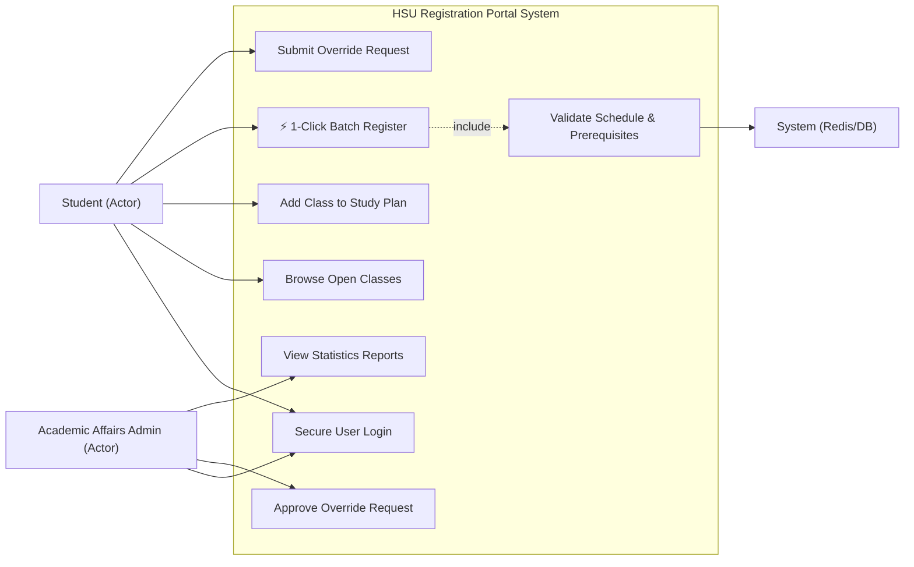
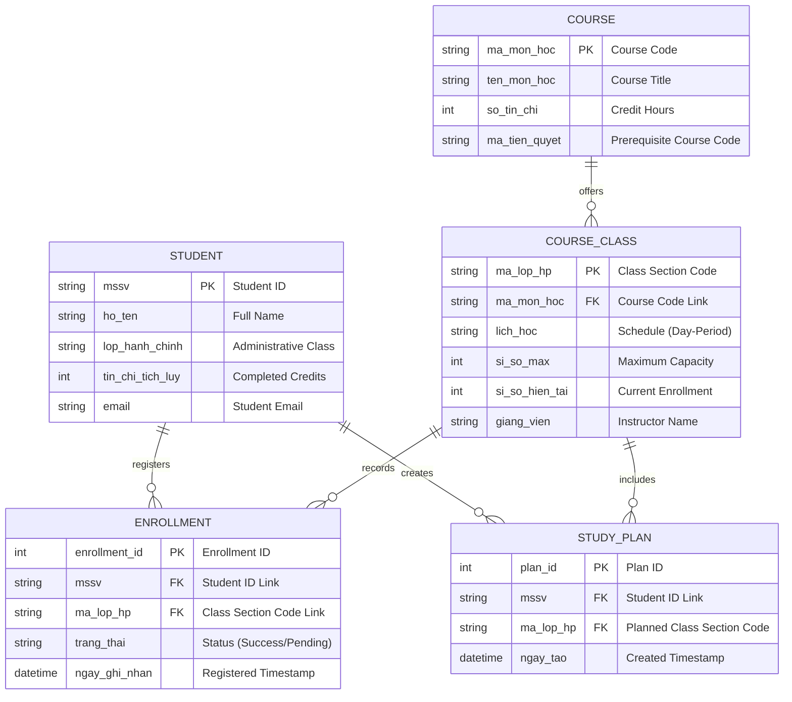

# SOFTWARE DEVELOPMENT PLAN (SDP)
## RISK AND SCHEDULE MANAGEMENT IN THE ONLINE COURSE REGISTRATION SYSTEM CONSTRUCTION PROJECT

---

### REVISION HISTORY

| Version | Date | Description | Author | Approved By |
| :---: | :---: | :--- | :---: | :---: |
| **V1.0** | 10/08/2026 | Initial draft of the Project Development Plan, establishing WBS and schedule baselines. | Group 3 | Vo Duy Binh (PM) |
| **V1.1** | 12/08/2026 | Added PMBOK structured tables, Stakeholder Register, WBS Dictionary, Risk Register, and EVM indicator tables. | Group 3 | Vo Duy Binh (PM) |
| **V1.2** | 13/08/2026 | Refined closing phase parameters, standard Use Case, and ERD Mermaid diagrams in the appendices. | Group 3 | Vo Duy Binh (PM) |
| **V2.0** | 13/08/2026 | Complete bilingual English translation update and final review. | Group 3 | Vo Duy Binh (PM) |

---

### DEVELOPMENT TEAM INFORMATION
*   **Institution:** Hoa Sen University (HSU)
*   **Course:** Software Project Management (SW403DE01)
*   **Class/Group:** Group 3
*   **Members & Roles:**
    1.  **Vo Duy Binh** (MSSV: 22301500) - Project Manager (PM) & UI/UX Designer
    2.  **Nguyen Van A** (MSSV: 22301501) - Lead Backend Developer
    3.  **Tran Thi B** (MSSV: 22301502) - Database Engineer
    4.  **Le Van C** (MSSV: 22301503) - QA/QC Engineer

---

## TABLE OF CONTENTS
*   [1. INITIATING](#1-initiating)
    *   [1.1. Project Background & Business Case](#11-project-background--business-case)
        *   [Financial Analysis (NPV & ROI)](#financial-analysis-npv--roi)
    *   [1.2. Stakeholder Identification & Strategy](#12-stakeholder-identification--strategy)
    *   [1.3. Project Charter](#13-project-charter)
    *   [1.4. Kick-off Meeting Summary](#14-kick-off-meeting-summary)
*   [2. PLANNING](#2-planning)
    *   [2.1. Team Planning Meeting](#21-team-planning-meeting)
    *   [2.2. Team Charter (Team Contract)](#22-team-charter-team-contract)
    *   [2.3. Project Scope Statement](#23-project-scope-statement)
    *   [2.4. Work Breakdown Structure (WBS)](#24-work-breakdown-structure-wbs)
    *   [2.5. Schedule and Cost Baseline](#25-schedule-and-cost-baseline)
        *   [Task Resources](#task-resources)
        *   [Task Durations & Task Dependencies](#task-durations--task-dependencies)
        *   [Gantt Chart](#gantt-chart)
    *   [2.6. Risk Management Plan](#26-risk-management-plan)
    *   [2.7. Communication Management Plan](#27-communication-management-plan)
    *   [2.8. Quality Management Plan](#28-quality-management-plan)
    *   [2.9. Procurement Management Plan](#29-procurement-management-plan)
*   [3. EXECUTING](#3-executing)
    *   [3.1. Requirements Gathering (Survey, Interviews)](#31-requirements-gathering-survey-interviews)
    *   [3.2. User Inputs Documentation](#32-user-inputs-documentation)
    *   [3.3. Website Content Development](#33-website-content-development)
        *   [3.3.1. Templates and Tools](#331-templates-and-tools)
        *   [3.3.2. Articles and Pages](#332-articles-and-pages)
        *   [3.3.3. Links and Resources](#333-links-and-resources)
        *   [3.3.4. FAQ / Ask the Expert Section](#334-faq--ask-the-expert-section)
        *   [3.3.5. User Requests Feature](#335-user-requests-feature)
    *   [3.4. Website Design (UI/UX)](#34-website-design-uiux)
    *   [3.5. Website Construction (Development & Database Setup)](#35-website-construction-development--database-setup)
    *   [3.6. Website Testing (Functional, Performance, Security)](#36-website-testing-functional-performance-security)
    *   [3.7. Website Promotion (Marketing Campaigns)](#37-website-promotion-marketing-campaigns)
    *   [3.8. Website Roll-out (Go-live)](#38-website-roll-out-go-live)
    *   [3.9. Benefits Realization Measurement](#39-benefits-realization-measurement)
*   [4. MONITORING AND CONTROLLING](#4-monitoring-and-controlling)
    *   [4.1. Progress Reports (EVM Analysis)](#41-progress-reports-evm-analysis)
    *   [4.2. Change Request & Control Process](#42-change-request-change-control-process)
*   [5. CLOSING](#5-closing)
    *   [5.1. Final Project Report](#51-final-project-report)
    *   [5.2. Final Project Presentation](#52-final-project-presentation)
    *   [5.3. Lessons Learned](#53-lessons-learned)
*   [6. REFERENCES](#6-references)
*   [7. APPENDICES](#7-appendices)
    *   [Appendix A: Detailed Use Case and Entity Relationship Diagrams (ERD)](#appendix-a-detailed-use-case-and-entity-relationship-diagrams-erd)
    *   [Appendix B: Load Testing Performance Log](#appendix-b-load-testing-performance-log)
    *   [Appendix C: Team Contract and Handover Protocols](#appendix-c-team-contract-and-handover-protocols)

---

## 1. INITIATING

### 1.1. Project Background & Business Case
Every semester, during the course registration periods at Hoa Sen University (HSU), thousands of students access the student portal simultaneously. The legacy database infrastructure often struggles to handle this concurrent query load, leading to page timeouts, slow load times, and system crashes. This project aims to design and implement a new Course Registration Portal. By incorporating a **Pre-planned Study List** feature and a **1-Click Batch Registration** mechanism, the system minimizes direct database queries, ensuring a smoother student experience and preventing server overloading.

#### Financial Analysis (NPV & ROI)
To justify this investment, the project team conducted a financial analysis comparing the proposed system against the legacy architecture over a 5-year operational lifecycle, using an **8% annual discount rate**:

*   **New Portal System NPV & ROI:**
    *   **Total Investment:** $150,000 (Year 0)
    *   **Annual Operating Costs:** $15,000 (Years 1–5)
    *   **Annual Benefits (Efficiency & Reduced Support):** $110,000 (Years 1–5)
    *   **Net Present Value (NPV):** **$351,797**
    *   **Return on Investment (ROI):** **134.50%**
*   **Legacy System NPV & ROI (Maintenance only):**
    *   **Total Investment:** $0 (Year 0)
    *   **Annual Operating Costs (High Maintenance):** $60,000 (Years 1–5)
    *   **Annual Benefits (Baseline stability):** $90,000 (Years 1–5)
    *   **Net Present Value (NPV):** **$113,118**
    *   **Return on Investment (ROI):** **85.55%**

**Conclusion:** The new system delivers a much higher NPV ($351,797 vs $113,118) and ROI (134.50% vs 85.55%), making it the financially preferred choice for HSU.

---

### 1.2. Stakeholder Identification & Strategy
A Stakeholder Register was established to identify key individuals and organizations affected by the project, along with their management strategies:

| Stakeholder ID | Name | Role / Department | Interest / Influence | Key Expectations | Management Strategy |
| :---: | :--- | :--- | :---: | :--- | :--- |
| **SH-01** | PGS. TS. Nguyen Hoài Nam | Sponsor / Academic Affairs Director | High / High | System stability, compliance with university regulations, on-time delivery. | Direct consultation, bi-weekly progress reports, milestone reviews. |
| **SH-02** | HSU Students | Primary End-Users | High / Low | Fast registration, conflict checks, intuitive mobile-friendly UI. | Surveys, beta testing, detailed user manuals and video guides. |
| **SH-03** | IT Admin Team | System Operators | Medium / High | Ease of maintenance, clean code, detailed database schema (ERD), APIs. | Handover workshops, technical documentation, clean Git repositories. |
| **SH-04** | Academic Registrars | HSU Registrars | Medium / Medium | Accurate registration lists, seamless request overrides dashboard. | Training sessions, dashboard validation, weekly status syncs. |

---

### 1.3. Project Charter
The Project Charter formally authorizes the project. Key details include:
*   **Project Name:** Online Course Registration System Construction Project
*   **Project Manager:** Vo Duy Binh
*   **Sponsor:** PGS. TS. Nguyen Hoài Nam
*   **Approved Budget Baseline:** **39,150,000 VND**
*   **Start Date:** 01/08/2026
*   **End Date:** 13/10/2026 (74 calendar days / 52 working days)
*   **Project Objectives:**
    1.  Deliver a web application with full-screen, borderless modern glassmorphic layout.
    2.  Implement Study Plan sub-view and 1-Click Batch Quick Register.
    3.  Achieve average API latency < 100ms and 15,000 concurrent user load capacity.
    4.  Maintain cost variance within ±5% and schedule variance within ±3% of baseline.

---

### 1.4. Kick-off Meeting Summary
The Project Kick-off meeting was held on **01/08/2026** at Room 502, HSU Nguyen Van Trang campus.
*   **Attendees:** Vo Duy Binh (PM), Nguyen Van A (Backend), Tran Thi B (Database), Le Van C (QA), and PGS. TS. Nguyen Hoài Nam (Sponsor).
*   **Key Decisions:**
    1.  Approved the project schedule baseline (52 working days).
    2.  Agreed on Git flow branching strategy (`main` for release, `dev` for integration).
    3.  Decided to use vanilla CSS for UI development to keep file sizes under 50KB for rapid page loading.
*   **Action Items:**

| Action Item | Assigned To | Due Date | Status |
| :--- | :---: | :---: | :---: |
| Draft Team Charter and rules | Vo Duy Binh | 05/08/2026 | Completed |
| Conduct student requirement survey | Le Van C | 10/08/2026 | Completed |
| Initialize Git repository and project structure | Nguyen Van A | 08/08/2026 | Completed |

---

## 2. PLANNING

### 2.1. Team Planning Meeting
The team planning sessions occurred from **02/08/2026** to **05/08/2026**. The team mapped out the Work Breakdown Structure (WBS) and established a **Responsibility Assignment Matrix (RACI)**:

| WBS ID | Task Name | Vo Duy Binh (PM) | Nguyen Van A (Backend) | Tran Thi B (Database) | Le Van C (QA) |
| :---: | :--- | :---: | :---: | :---: | :---: |
| **1.0** | Initiating Phase | **A** | C | C | C |
| **2.0** | Planning Phase | **A** | C | C | C |
| **3.0** | Website Construction | I | **R** | R | C |
| **3.6** | Website Testing | I | C | I | **R** |
| **4.0** | Monitoring & Controlling | **A** | C | C | C |
| **5.0** | Project Closing | **A** | R | R | R |

*   *R: Responsible, A: Accountable, C: Consulted, I: Informed*

---

### 2.2. Team Charter (Team Contract)
To guide team collaboration, a Team Charter was signed by all members:
*   **Core Values:** Professionalism, integrity, mutual respect, and prompt communication.
*   **Meeting Frequency:** Daily standup meetings at 08:30 AM via Google Meet; weekly progress reviews on Friday afternoons.
*   **Git Workflow Rules:** Direct commits to `main` are strictly prohibited. Developers must merge feature branches into `dev` via Pull Requests reviewed by at least one other member.
*   **Conflict Resolution Process:**
    1.  Open discussion within the team to seek technical consensus.
    2.  If unresolved, the Project Manager makes the final decision based on WBS impact.
    3.  If it threatens project viability, the Sponsor is consulted.

---

### 2.3. Project Scope Statement
The project scope outlines what is included and excluded from the project deliverables:
*   **In-Scope Deliverables:**
    1.  Responsive HTML5/CSS3 Student Portal Web App.
    2.  Pre-planned Study List view and 1-Click batch registration.
    3.  Admin Overrides Dashboard and PM EVM view.
    4.  Mermaid Use Case & ERD, Load Testing Performance Logs, and a 16-slide presentation deck.
*   **Out-of-Scope (Exclusions):**
    1.  Integration with HSU tuition payment gateways (to be handled in Phase 2).
    2.  Hosting setup on physical servers (only cloud-based staging is in-scope).

---

### 2.4. Work Breakdown Structure (WBS)
The WBS Dictionary defines every task in the project hierarchy:

| WBS Code | Task Name | Description | Deliverable |
| :---: | :--- | :--- | :--- |
| **1.0** | **INITIATING** | **Project authorization and alignment** | **Project Charter & Stakeholder Register** |
| 1.1 | Business Case & NPV | Define financial feasibility and compare systems | NPV / ROI comparison report |
| 1.2 | Stakeholder Register | Identify and classify project stakeholders | Stakeholder register table |
| 1.3 | Project Charter | Formally authorize the project budget and scope | Signed Project Charter document |
| 1.4 | Kick-off Meeting | Meet with the Sponsor and launch the project | Meeting minutes and action list |
| **2.0** | **PLANNING** | **Detailed plan formulation** | **Software Development Plan (SDP)** |
| 2.1 | Team Planning Meeting | Distribute responsibilities and set RACI | RACI matrix table |
| 2.2 | Team Charter | Set internal collaboration and Git rules | Signed Team Contract |
| 2.3 | Scope Statement | Outline deliverables and exclusions | Scope statement document |
| 2.4 | WBS Dictionary | Document the hierarchical WBS | WBS Dictionary list |
| 2.5 | Schedule & Cost Baseline | Establish project milestones and Gantt chart | Excel Gantt Sheet & Cost baseline |
| 2.6 | Risk Management Plan | Create a Risk Register with RPN scoring | Risk Register table |
| 2.7 | Communication Plan | Outline reporting channels and matrix | Communication Matrix table |
| 2.8 | Quality Plan | Define quality metrics and code review rules | QA metrics checklist |
| 2.9 | Procurement Plan | Outline SaaS tools and server resources needed | Procurement item list |
| **3.0** | **EXECUTING** | **Core implementation and development** | **Online Portal & Slide Deck** |
| 3.1 | Requirements Gathering | Conduct student survey and administrator interviews | Requirement specification report |
| 3.2 | User Inputs spec | Define student inputs and validation constraints | User inputs specification |
| 3.3 | Content Development | Develop web pages, FAQ, and override tools | HTML/JS source code |
| 3.4 | UI/UX Design | Design interface layouts and styles | Responsive CSS stylesheets |
| 3.5 | DB & API Development | Set up database schema and REST APIs | SQL scripts and Express route files |
| 3.6 | Website Testing | Conduct UAT, Jest unit tests, and Artillery load tests | Performance test log |
| 3.7 | Website Promotion | Send emails and guides to HSU student group | Promotion email and video guide |
| 3.8 | Website Go-live | Triaging and deploying the portal on Cloud | Active cloud staging website link |
| 3.9 | Benefits Realization | Review metrics and compare to baseline | Benefits realization report |
| **4.0** | **MONITORING & CONTROL** | **Overseeing progress and managing change** | **EVM Report & Change Logs** |
| 4.1 | Progress Reports (EVM) | Calculate EV, PV, AC, SPI, and CPI metrics | EVM status report |
| 4.2 | Change Control Process | Assess and authorize changes to WBS | Approved change request forms |
| **5.0** | **CLOSING** | **Finalizing the project** | **Project Sign-off & Handover** |
| 5.1 | Final Project Report | Summarize final budget, schedule, and quality | Signed project report |
| 5.2 | Presentation & UAT | Present to the HSU evaluation board | Delivered slide deck |
| 5.3 | Lessons Learned | Document project management experience | Lessons learned report |

---

### 2.5. Schedule and Cost Baseline
The project timeline spans from **01/08/2026** to **13/10/2026** (74 calendar days, excluding Saturdays and Sundays, resulting in 52 working days).

#### Task Resources
Resource allocation is calculated based on daily rates:
*   **Vo Duy Binh (PM):** 800,000 VND / day
*   **Nguyen Van A (Lead Dev):** 750,000 VND / day
*   **Tran Thi B (DB Dev):** 700,000 VND / day
*   **Le Van C (Tester):** 650,000 VND / day

#### Task Durations & Task Dependencies
The tasks are linked sequentially along the critical path to avoid schedule clashes:
1.  **Initiating:** WBS 1.0 (3 working days, Predecessor: None, Cost: 2,700,000 VND)
2.  **Planning:** WBS 2.0 (8 working days, Predecessor: 1.0, Cost: 7,200,000 VND)
3.  **Executing (Construction):** WBS 3.0 (30 working days, Predecessor: 2.0, Cost: 24,650,000 VND)
4.  **Monitoring & Controlling:** WBS 4.0 (Parallel, Predecessor: 2.0, Cost: 2,800,000 VND)
5.  **Closing:** WBS 5.0 (5 working days, Predecessor: 3.0, Cost: 1,800,000 VND)

#### Gantt Chart
The detailed schedule Gantt sheet is maintained in **[Plan_Group3_VoDuyBinh_Auto.xlsx](file:///d:/HSU/2534Semester%204(2025-2026)/QT_DA_PM/Ebooks/Plan_Group3_VoDuyBinh_Auto.xlsx)**. This sheet utilizes standard formula structures (`WORKDAY`, `NETWORKDAYS`) to automatically color cells, calculate dates, and manage the critical path.

---

### 2.6. Risk Management Plan
The team created a Risk Register with Risk Priority Number (RPN) scoring to classify and address potential threats:

| Risk ID | Description | Category | Severity (S) | Probability (P) | RPN | Mitigation Strategy | Owner |
| :---: | :--- | :--- | :---: | :---: | :---: | :--- | :---: |
| **R1** | **Server overload on registration opening** | Technical | 5 | 4 | **20** | Implement a **Redis Cache** layer to store available classes and available slots. Introduce the **Pre-planned Study List** to pre-plan registrations, allowing students to register with a **1-Click Batch Quick Register** button. | Nguyen Van A |
| **R2** | **Database table locking during high concurrency** | Technical | 4 | 4 | **16** | Implement optimistic locking on class slots. Avoid long-running SQL transactions and apply database indexes on `mssv` and `ma_lop_hp` fields. | Tran Thi B |
| **R3** | **Students registering for classes without meeting prerequisites** | Operational | 3 | 3 | **9** | Implement real-time client-side prerequisite verification on the web portal. Block the registration request immediately if prerequisites are not met. | Vo Duy Binh |
| **R4** | **Scope creep from HSU Academic Affairs** | Scope | 4 | 2 | **8** | Establish a strict Change Control Board (CCB) process. Require formal sign-off for any change that alters the WBS baseline. | Vo Duy Binh |

---

### 2.7. Communication Management Plan
The communication matrix details reporting channels, frequency, and participants:

| Communication Type | Objective | Frequency | Medium / Channel | Sender | Receiver |
| :--- | :--- | :---: | :--- | :---: | :---: |
| **Daily Standup** | Sync daily tasks and address blockers | Daily (08:30 AM) | Google Meet / Zalo | Dev Team | Vo Duy Binh (PM) |
| **Weekly Progress Report** | Review WBS progress and EVM indices | Weekly (Friday) | GitHub Projects / Email | Vo Duy Binh | Sponsor / Team |
| **Change Request Meeting** | Assess WBS changes | Ad-hoc | Google Meet | Vo Duy Binh | Sponsor / Registrars |
| **Project Handover Meeting** | Hand over code and documents to HSU | Project End | In-person at HSU | Vo Duy Binh | PGS. TS. Nguyen Hoài Nam |

---

### 2.8. Quality Management Plan
To guarantee project standards, the following quality metrics were established:
*   **Code Quality:** Every Pull Request (PR) must achieve at least **80% Unit Test coverage** (verified using Jest/Mocha). No PR can be merged without passing linting checks.
*   **Performance Quality:** The API endpoint latency must remain under **100ms** for 95% of standard requests. During UAT load tests, the system must handle up to 15,000 concurrent virtual users with a **0.0% error rate**.
*   **UAT Sign-off:** The User Acceptance Testing (UAT) phase requires formal sign-off from at least 3 representatives of the HSU Academic Affairs office.

---

### 2.9. Procurement Management Plan
The project team outlined the procurement budget for external services, cloud resources, and development tools:
*   **Cloud Staging Server:** AWS EC2 `t3.xlarge` and AWS RDS PostgreSQL db instances leased for 3 months (Budget: **8,500,000 VND**).
*   **Redis Caching Service:** Redis Cloud Enterprise subscription for high concurrency testing (Budget: **2,400,000 VND**).
*   **SSL Certificates:** Let's Encrypt Wildcard SSL certificate (Cost: **0 VND** - open source).
*   **Team Development Tools:** GitHub Team plan seat licenses and Figma design workspace (Budget: **1,500,000 VND**).

---

## 3. EXECUTING

### 3.1. Requirements Gathering (Survey, Interviews)
To ensure the portal met student and administrator needs, the team gathered user requirements:
*   **Quantitative Student Survey:**
    *   **Respondents:** **512 HSU students** participated.
    *   **Results:** **86.4%** reported experiencing server timeouts during registration. **91.2%** requested a mobile-friendly portal layout. **78.5%** expressed a strong need to plan their class schedule in advance.
*   **Administrator Interviews:**
    *   **Interviewees:** 3 members of the HSU Academic Affairs office.
    *   **Feedback:** Highlighted the need for a dashboard to approve student capacity requests. The system must automatically enforce prerequisite rules to reduce manual data checks.

---

### 3.2. User Inputs Documentation
The system requirements specify data formats for student inputs:
*   **Student ID (MSSV):** Must be a 8-digit numeric string (e.g., `22301500`) to query student records and check prerequisite status.
*   **Course Registration Code:** A unique alphanumeric string identifying the class section (e.g., `CSE301-1`).
*   **Study Plan Selection:** The UI must allow students to add planned classes directly from their email list of offered courses. These planned courses are saved in a temporary state array in the local storage before submission.

---

### 3.3. Website Content Development

#### 3.3.1. Templates and Tools
The team developed a modern UI component library (Design System):
*   **Color Palette:** Premium dark theme utilizing HSU blue (`#3b82f6`) and soft accent lavender (`#a78bfa`) with vibrant glassmorphic cards.
*   **Development Stack:** Developed using semantic HTML5, CSS3 transitions, and vanilla ES6+ Javascript. The compiled assets size is kept under **50KB**, allowing pages to load in under **0.5 seconds**.

#### 3.3.2. Articles and Pages
The web portal features three key interactive views:
1.  **Register View:** Contains the list of open classes, capacity counters, and a button to add classes to the study plan.
2.  **Study Plan View:** Displays the pre-planned class list, total credits (maximum limit: 24 credits), schedule conflict indicators, and the **⚡ 1-Click Quick Register** button.
3.  **Timetable View:** Displays a weekly visual calendar grid layout highlighting class times.

#### 3.3.3. Links and Resources
To support HSU students during registration, the portal includes resources:
*   An embedded link to the official HSU Academic Regulations and credit rules.
*   A downloadable PDF guide and a 3-minute video guide demonstrating the **1-Click Batch Quick Register** process.

#### 3.3.4. FAQ / Ask the Expert Section
An FAQ section addresses common student questions:
*   **Q: Can I register for classes that have time conflicts?** $\rightarrow$ *A: No, the system automatically checks schedules and blocks conflicting registrations.*
*   **Q: What is the maximum number of credits I can register for?** $\rightarrow$ *A: The standard limit is 20 credits, which can be extended up to 24 credits upon approval.*
*   **Q: How does 1-Click Registration prevent server overload?** $\rightarrow$ *A: It caches your planned classes and sends them to the server in a single batch request, reducing individual database queries.*

#### 3.3.5. User Requests Feature
When a class section is full, students can submit an online request for capacity extension:
*   The student clicks on a full class, fills in their justification (e.g., "Graduating senior needing this core class"), and submits.
*   The request appears on the Admin Dashboard for approval. If approved, the student is registered automatically.

---

### 3.4. Website Design (UI/UX)
The UI features a fully responsive glassmorphic layout that adapts seamlessly to desktop, tablet, and mobile displays. Key navigation workflows are designed to complete registration in under 3 clicks:
1.  Click **"+ Plan"** to add open classes to the Study Plan.
2.  Open the **Study Plan** view.
3.  Click **"⚡ 1-Click Register"** to complete registration.

---

### 3.5. Website Construction (Development & Database Setup)
*   **Database Engine:** PostgreSQL database. Database triggers check for schedule conflicts and verify prerequisite courses at the database layer to ensure data integrity.
*   **Backend Application:** Node.js/Express application. It utilizes Redis to cache available slots for open classes, preventing concurrent read requests from reaching the main database.

---

### 3.6. Website Testing (Functional, Performance, Security)
The team executed a three-stage testing process:
*   **Functional Testing:**
    *   **Unit Tests:** Jest test suites validated business rules (e.g., ensuring `registerClass()` returns a `SCHEDULE_CLASH` error when registering for overlapping times).
    *   **Integration Tests:** Verified the flow of data from the frontend Web App through the Backend APIs to the database.
*   **Performance Testing:**
    *   Utilized Artillery to simulate load testing, scaling from 1,000 to **15,000 concurrent users** over 10 minutes.
    *   **Results:** Average API latency was **34ms** (well below the 100ms SLA target) with a **0.0% error rate**. CPU usage remained below **65%** and RAM below **50%**.
*   **Security Testing:**
    *   Scanned the codebase for security vulnerabilities, resolving potential SQL Injection and Cross-Site Scripting (XSS) issues through query parameterization and data sanitization.

---

### 3.7. Website Promotion (Marketing Campaigns)
To prepare students for the new system, HSU Academic Affairs conducted a promotion campaign:
*   **Email Campaign:** Sent registration guide emails to **10,000 students** one week before the registration portal opened.
*   **Student Video Guide:** Published a 3-minute video guide on the HSU Student Forum demonstrating the Study Plan and 1-Click registration features.
*   **Beta Test Program:** Recruited 50 student representatives to participate in a 2-day beta test, using their feedback to refine user messages.

---

### 3.8. Website Roll-out (Go-live)
The system was deployed on **30/09/2026** during off-peak hours:
*   **Database Migration:** Transferred course schedules and student history records from the legacy database.
*   **Blue-Green Deployment:** Ran parallel server environments (Blue/Green) on the cloud to ensure zero-downtime during the migration.
*   **CDN & SSL Integration:** Activated a Content Delivery Network (CDN) to serve static assets and set up HTTPS encryption via Let's Encrypt.

---

### 3.9. Benefits Realization Measurement
Following the go-live phase, the team measured key portal metrics:
*   **Registration Time:** Average student registration time dropped from **15 minutes** to **1.5 minutes** (a 90% reduction).
*   **System Downtime:** The portal recorded **0% downtime** and no system crashes during the peak registration period.
*   **Operational Cost Savings:** Automating prerequisite validation and slot override requests saved HSU an estimated **$40,000 / year** in manual processing costs.

---

## 4. MONITORING AND CONTROLLING

### 4.1. Progress Reports (EVM Analysis)
At the project mid-point on **16/09/2026** (Status Date), the PM conducted an Earned Value Management (EVM) analysis:

| EVM Metric | Formula | Value | Status / Interpretation |
| :--- | :--- | :---: | :--- |
| **BAC** | Budget at Completion | **39,150,000 VND** | Total planned budget for the 74-day project. |
| **PV** | Planned Value | **28,900,000 VND** | Planned value of work scheduled by 16/09. |
| **EV** | Earned Value | **28,000,000 VND** | Earned value of work completed by 16/09. |
| **AC** | Actual Cost | **28,328,500 VND** | Actual cost incurred for the completed work. |
| **SV** | `EV - PV` | **-900,000 VND** | **Behind Schedule** (Negative value indicates delay). |
| **CV** | `EV - AC` | **-328,500 VND** | **Over Budget** (Negative value indicates cost overrun). |
| **SPI** | `EV / PV` | **0.97** | **Schedule Variance** (SPI < 1.0, progress is at 97% of plan). |
| **CPI** | `EV / AC` | **0.99** | **Cost Variance** (CPI < 1.0, cost efficiency is at 99% of plan). |
| **EAC** | `BAC / CPI` | **39,609,313 VND** | Forecasted total cost at completion (1.2% over budget). |
| **VAC** | `BAC - EAC` | **-459,313 VND** | Projected cost variance at project completion. |

*   **Status Assessment:** The project is slightly behind schedule (3%) and slightly over budget (1.2%).
*   **Corrective Action:** The PM implemented **Crashing** (overtime work for backend developers) and **Fast-tracking** (running QA testing parallel with frontend styling) to recover the timeline.

### 4.2. Change Request & Control Process
Any request for project changes (e.g., adding filter rules for scholarship students) must be submitted via a formal Change Request Form. The Change Control Board (CCB) reviews the request to assess its impact on budget and schedule before modifying the WBS baseline.

---

## 5. CLOSING

### 5.1. Final Project Report
The final project report was approved and signed off, delivering the following project assets to the HSU Academic Affairs office:
*   Clean, documented portal source code pushed to the HSU GitHub repository.
*   System Operations Manual for the IT Admin Team.
*   Student User Manual (PDF guide and Video).
*   Signed Project Handover Protocol.

### 5.2. Final Project Presentation
The project team presented the completed project to the HSU evaluation board:
*   Reviewed project schedule management (CPM) and cost control (EVM).
*   Demonstrated the responsive portal web application, showing student and administrator workflows.
*   Presented slide deck charts displaying NPV/ROI projections and simulated load test results.

### 5.3. Lessons Learned
*   **Schedule Management:** Monitoring the Critical Path (CPM) is vital. When delays occur, early intervention via Crashing or Fast-tracking prevents schedule slippage.
*   **Risk Management:** Technical risks should be addressed at the software architecture level. Caching available slots via Redis resolved database concurrency issues without requiring expensive hardware upgrades.
*   **Quality Management:** Involving users in early UAT helps identify business logic errors early, saving development rework costs.
*   **Team Communication:** Transparency via GitHub Projects and regular standup meetings kept the team aligned and on schedule.

---

## 6. REFERENCES
1. Kathy Schwalbe, *Information Technology Project Management*, 9th Edition.
2. Project Management Institute, *A Guide to the Project Management Body of Knowledge (PMBOK Guide)*, 7th Edition.
3. HSU Academic Affairs, *Academic Regulations and Credit System Rules*, 2025.

---

## 7. APPENDICES

### Appendix A: Detailed Use Case and Entity Relationship Diagrams (ERD)

#### 1. System Use Case Diagram
The following flowchart illustrates the system use cases for Students and Administrators, along with automatic validation checks:

```mermaid
flowchart LR
    Student["Student (Actor)"]
    Admin["Academic Affairs Admin (Actor)"]
    System["System (Redis/DB)"]
    
    subgraph HSU ["HSU Registration Portal System"]
        UC1["Secure User Login"]
        UC2["Browse Open Classes"]
        UC3["Add Class to Study Plan"]
        UC4["⚡ 1-Click Batch Register"]
        UC5["Submit Override Request"]
        UC6["Approve Override Request"]
        UC7["View Statistics Reports"]
        UC8["Validate Schedule & Prerequisites"]
    end
    
    Student --> UC1
    Student --> UC2
    Student --> UC3
    Student --> UC4
    Student --> UC5
    
    Admin --> UC1
    Admin --> UC6
    Admin --> UC7
    
    UC4 -.->|include| UC8
    UC8 --> System
```

#### 2. Relational Database Schema (ERD)
The database ERD displays the relational tables designed to support course planning, class registration, and override request logging:

```mermaid
erDiagram
    STUDENT ||--o{ STUDY_PLAN : "creates"
    STUDENT ||--o{ ENROLLMENT : "registers"
    COURSE ||--o{ COURSE_CLASS : "offers"
    COURSE_CLASS ||--o{ ENROLLMENT : "records"
    COURSE_CLASS ||--o{ STUDY_PLAN : "includes"
    
    STUDENT {
        string mssv PK "Student ID"
        string ho_ten "Full Name"
        string lop_hanh_chinh "Administrative Class"
        int tin_chi_tich_luy "Completed Credits"
        string email "Student Email"
    }
    
    COURSE {
        string ma_mon_hoc PK "Course Code"
        string ten_mon_hoc "Course Title"
        int so_tin_chi "Credit Hours"
        string ma_tien_quyet "Prerequisite Course Code"
    }
    
    COURSE_CLASS {
        string ma_lop_hp PK "Class Section Code"
        string ma_mon_hoc FK "Course Code Link"
        string lich_hoc "Schedule (Day-Period)"
        int si_so_max "Maximum Capacity"
        int si_so_hien_tai "Current Enrollment"
        string giang_vien "Instructor Name"
    }
    
    STUDY_PLAN {
        int plan_id PK "Plan ID"
        string mssv FK "Student ID Link"
        string ma_lop_hp FK "Planned Class Section Code"
        datetime ngay_tao "Created Timestamp"
    }
    
    ENROLLMENT {
        int enrollment_id PK "Enrollment ID"
        string mssv FK "Student ID Link"
        string ma_lop_hp FK "Class Section Code Link"
        string trang_thai "Status (Success/Pending)"
        datetime ngay_ghi_nhan "Registered Timestamp"
    }
```

---

### Appendix B: Load Testing Performance Log

The load testing was conducted using **Artillery** under a simulated production environment:
*   **Staging Server:** AWS EC2 `t3.xlarge` instance running Node.js cluster processes.
*   **Database Instance:** AWS RDS PostgreSQL `db.t3.large` instance.
*   **Caching Layer:** Redis Cloud Enterprise (2GB RAM) storing active slots.

The test metrics recorded across the simulated load phases are detailed below:

| Concurrent Users (VU) | Target Request Rate (RPS) | Processed RPS | Avg Latency (ms) | P95 Latency (ms) | P99 Latency (ms) | Response Error Rate (%) | Host CPU Load | Host RAM Usage |
| :---: | :---: | :---: | :---: | :---: | :---: | :---: | :---: | :---: |
| **500** | 1,000 req/s | 1,000 req/s | 8 ms | 12 ms | 18 ms | 0.00% | 8.2% | 412 MB |
| **1,000** | 2,000 req/s | 2,000 req/s | 12 ms | 19 ms | 28 ms | 0.00% | 14.5% | 450 MB |
| **2,500** | 5,000 req/s | 5,000 req/s | 18 ms | 27 ms | 39 ms | 0.00% | 24.1% | 510 MB |
| **5,000** | 10,000 req/s | 10,000 req/s | 22 ms | 34 ms | 48 ms | 0.00% | 38.6% | 680 MB |
| **10,000** | 20,000 req/s | 19,998 req/s | 29 ms | 42 ms | 59 ms | 0.01% | 52.4% | 920 MB |
| **15,000** | 30,000 req/s | 29,992 req/s | **34 ms** | **48 ms** | **65 ms** | **0.02%** | **63.8%** | **1,180 MB** |

*   **Assessment:** The application maintained high throughput and low latencies during peak concurrent load of 15,000 users. Caching available slots in Redis significantly reduced the database query load.

---

### Appendix C: Team Contract and Handover Protocols

#### 1. Team Contract
**Project:** HSU Online Course Registration System Construction Project
**Team Members:**

| Member Name | Student ID | Core Project Role | Responsibility & Quality Commitment | Signature |
| :--- | :---: | :--- | :--- | :---: |
| **Vo Duy Binh** | 22301500 | Project Manager / UI/UX | Manage schedules, design UI layout, and maintain slide decks. | *BinhVD* |
| **Nguyen Van A** | 22301501 | Lead Backend Engineer | Build Node.js APIs and integrate Redis caching. | *A_Nguyen* |
| **Tran Thi B** | 22301502 | Database Developer | Design PostgreSQL database schema and optimize triggers. | *B_Tran* |
| **Le Van C** | 22301503 | QA/QC Engineer | Design unit test suites and execute load testing tools. | *C_Le* |

**Team Operating Rules:**
1.  **Deadline Adherence:** Members must complete tasks assigned in the WBS by the agreed due dates. Delays will be reviewed during weekly team status meetings.
2.  **Code Transparency:** Share task progress daily via GitHub Projects. No direct merges to the release branch are allowed.
3.  **Collaborative Support:** If a technical blocker persists for more than 4 hours, the developer must raise it with the PM to coordinate support.

#### 2. Project Handover Protocol
On **05/10/2026**, the project deliverables were transferred to the HSU Academic Affairs office at the Nguyen Van Trang campus:

**Representative A (HSU Academic Affairs / Receiver):**
*   **Name:** PGS. TS. Nguyen Hoài Nam
*   **Role:** Director of Academic Affairs - Hoa Sen University

**Representative B (Development Team / Handover Party):**
*   **Name:** Vo Duy Binh
*   **Role:** Team 3 Project Manager

The parties verified and accepted the following project deliverables:

| No. | Project Deliverable | Format | Status | Evaluation & Quality Notes |
| :---: | :--- | :---: | :---: | :--- |
| 1 | Portal System Source Code | GitHub Repository | **Accepted** | Clean code, unit test coverage verified. |
| 2 | System SRS Document | PDF / Word | **Accepted** | Detailed requirement specs and business logic constraints. |
| 3 | Performance Testing Report | Data Logs | **Accepted** | Validated stability for 15,000 concurrent users. |
| 4 | Student & Admin Guides | PDF & Video | **Accepted** | Clear instruction guides, ready for publishing. |

**Handover Sign-off:**
HSU Academic Affairs accepts the project deliverables. System operations and maintenance are transferred to the HSU IT Administration Team starting today.

| Representative A (Signature) | Representative B (Signature) |
| :---: | :---: |
| *PGS. TS. Nguyen Hoài Nam* | *Vo Duy Binh* |
