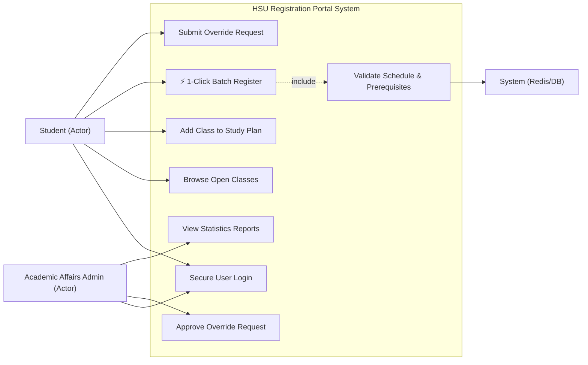
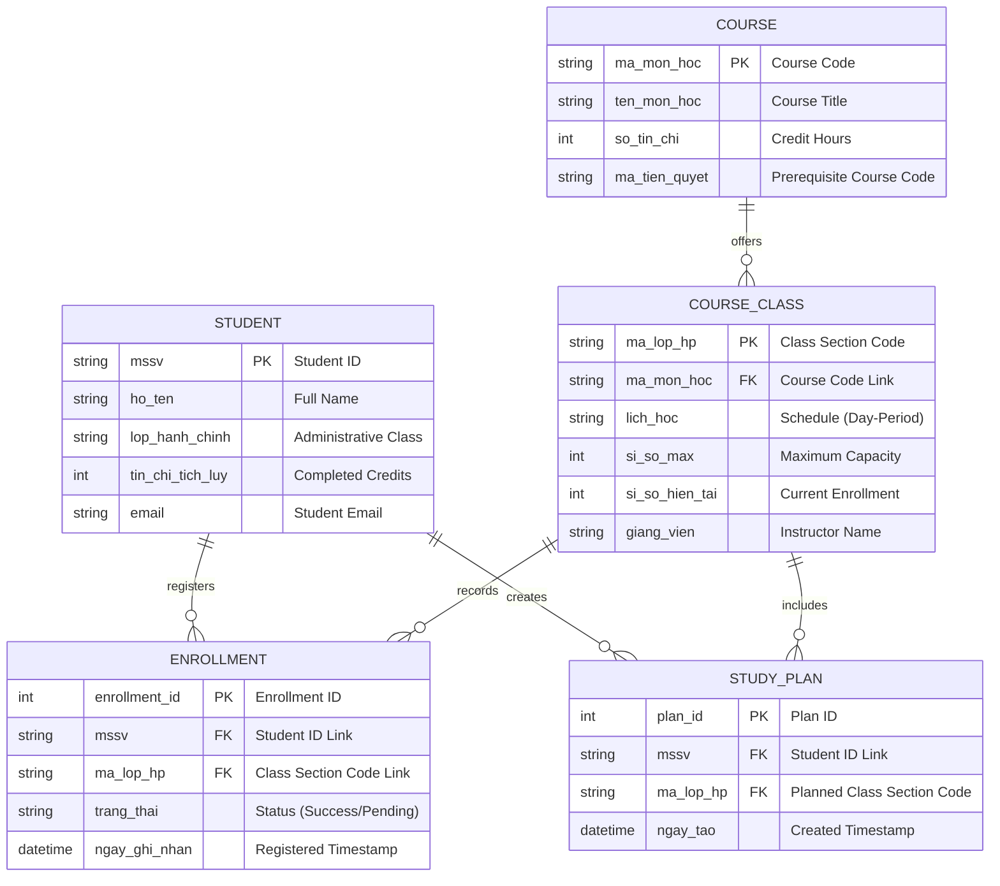

# SOFTWARE DEVELOPMENT PLAN (SDP)

## ONLINE COURSE REGISTRATION SYSTEM CONSTRUCTION PROJECT

---

### REVISION HISTORY

|    Version    |    Date    | Description                                                                                                   | Author |   Approved By   |
| :------------: | :--------: | :------------------------------------------------------------------------------------------------------------ | :-----: | :--------------: |
| **V1.0** | 22/07/2026 | Initial draft of the Project Development Plan, establishing WBS and schedule baselines.                       | Group 3 | Vo Duy Binh (PM) |
| **V1.1** | 24/07/2026 | Added PMBOK structured tables, Stakeholder Register, WBS Dictionary, Risk Register, and EVM indicator tables. | Group 3 | Vo Duy Binh (PM) |
| **V1.2** | 25/07/2026 | Refined closing phase parameters, standard Use Case, and ERD Mermaid diagrams in the appendices.              | Group 3 | Vo Duy Binh (PM) |
| **V2.0** | 25/07/2026 | Bilingual English translation update and final review of all content sections.                                | Group 3 | Vo Duy Binh (PM) |
| **V3.0** | 25/07/2026 | Restructured to match the HSU Software Development Plan (SDP) official template exactly.                      | Group 3 | Vo Duy Binh (PM) |

---

### DEVELOPMENT TEAM INFORMATION

* **Institution:** Hoa Sen University (HSU)
* **Course:** Software Project Management (SW403DE01)
* **Instructor:** Nguyễn Văn Sơn
* **Class/Group:** Group 3
* **Members & Roles:**
  1. **Vo Duy Binh** (Student ID: 22301500) - Team Leader / PM / UI/UX Designer
  2. **Hong Bao Khang** (Student ID: 22101347) - Lead Backend & Financial Developer
  3. **Tran Ba Loi** (Student ID: 22300236) - Project Manager (PM) & QA Engineer
  4. **Nguyen Thanh Quang** (Student ID: 22110739) - Business & Risk Analyst / UI/UX Designer / Tester

---

## TABLE OF CONTENTS

* [1. INTRODUCTION](#1-introduction)
  * [1.1. Purpose](#11-purpose)
  * [1.2. Scope](#12-scope)
  * [1.3. Definitions, Acronyms, and Abbreviations](#13-definitions-acronyms-and-abbreviations)
  * [1.4. References](#14-references)
  * [1.5. Overview](#15-overview)
* [2. PROJECT OVERVIEW](#2-project-overview)
  * [2.1. Project Purpose, Scope, and Objectives](#21-project-purpose-scope-and-objectives)
  * [2.2. Assumptions and Constraints](#22-assumptions-and-constraints)
  * [2.3. Project Deliverables](#23-project-deliverables)
  * [2.4. Evolution of the Software Development Plan](#24-evolution-of-the-software-development-plan)
* [3. PROJECT ORGANIZATION](#3-project-organization)
  * [3.1. Organizational Structure](#31-organizational-structure)
  * [3.2. External Interfaces](#32-external-interfaces)
  * [3.3. Roles and Responsibilities](#33-roles-and-responsibilities)
* [4. MANAGEMENT PROCESS](#4-management-process)
  * [4.1. Start-up Plan](#41-start-up-plan)
    * [4.1.1. Estimation Plan](#411-estimation-plan)
    * [4.1.2. Staffing Plan](#412-staffing-plan)
    * [4.1.3. Resource Acquisition Plan](#413-resource-acquisition-plan)
    * [4.1.4. Staff Training Plan](#414-staff-training-plan)
    * [4.1.5. Kick-off Meeting Summary](#415-kick-off-meeting-summary)
  * [4.2. Work Plan](#42-work-plan)
    * [4.2.1. Work Activities](#421-work-activities)
    * [4.2.2. Schedule Allocation](#422-schedule-allocation)
    * [4.2.3. Resource Allocation](#423-resource-allocation)
  * [4.3. Control Plan](#43-control-plan)
    * [4.3.1. Requirement Control Plan](#431-requirement-control-plan)
    * [4.3.2. Schedule Control Plan](#432-schedule-control-plan)
    * [4.3.3. Quality Control Plan](#433-quality-control-plan)
    * [4.3.4. Reporting Plan](#434-reporting-plan)
    * [4.3.5. Metrics Collection Plan](#435-metrics-collection-plan)
  * [4.4. Risk Management Plan](#44-risk-management-plan)
    * [4.4.1. Tasks](#441-tasks)
    * [4.4.2. Responsibilities](#442-responsibilities)
    * [4.4.3. Tools and Techniques](#443-tools-and-techniques)
    * [4.4.4. Risk Item List](#444-risk-item-list)
  * [4.5. Close-out Plan](#45-close-out-plan)
* [5. TECHNICAL PROCESS PLANS](#5-technical-process-plans)
  * [5.1. Process Model](#51-process-model)
  * [5.2. Methods, Tools, and Techniques](#52-methods-tools-and-techniques)
  * [5.3. Infrastructure Plan](#53-infrastructure-plan)
  * [5.4. Product Acceptance Plan](#54-product-acceptance-plan)
* [6. SUPPORTING PROCESS PLANS](#6-supporting-process-plans)
  * [6.1. Configuration Management Plan](#61-configuration-management-plan)
  * [6.2. Documentation Plan](#62-documentation-plan)
  * [6.3. Quality Assurance Plan](#63-quality-assurance-plan)
  * [6.4. Verification and Validation Plan](#64-verification-and-validation-plan)
  * [6.5. Problem Resolution Plan](#65-problem-resolution-plan)
  * [6.6. Review Plan](#66-review-plan)
* [7. ADDITIONAL PLANS](#7-additional-plans)
  *   [7.1. Website Promotion (Marketing Campaigns)](#71-website-promotion-marketing-campaigns)
  *   [7.2. Website Roll-out (Go-live)](#72-website-roll-out-go-live)
  *   [7.3. Benefits Realization Measurement](#73-benefits-realization-measurement)
  *   [7.4. Business Continuity &amp; Backup Strategy](#74-business-continuity--backup-strategy)
* [8. ANNEXES](#8-annexes)
* [9. INDEX](#9-index)

---

## 1. INTRODUCTION

### 1.1. Purpose

The purpose of this Software Development Plan (SDP) is to outline the project management and technical processes for the development of the new Online Course Registration System at Hoa Sen University (HSU). This plan coordinates scheduling, budgeting, risk management, and quality control strategies to ensure the system is delivered on time, within budget, and to the required quality standards.

### 1.2. Scope

This project covers the complete software development lifecycle (SDLC) of the HSU Course Registration Portal. The system features a responsive, dark-themed user interface, a temporary **Pre-planned Study List** view, and a **1-Click Batch Quick Register** mechanism to optimize performance under heavy concurrent loads. The scope includes requirement validation, system architecture setup, database design, REST API coding, unit testing, load testing, and go-live deployment. Excluded from this phase are direct tuition fee processing and physical local server setups (cloud-based environments are utilized instead).

### 1.3. Definitions, Acronyms, and Abbreviations

* **SDP:** Software Development Plan
* **WBS:** Work Breakdown Structure
* **EVM:** Earned Value Management
* **NPV:** Net Present Value
* **ROI:** Return on Investment
* **RPN:** Risk Priority Number
* **UAT:** User Acceptance Testing
* **HSU:** Hoa Sen University
* **BAC:** Budget at Completion
* **PV:** Planned Value
* **EV:** Earned Value
* **AC:** Actual Cost
* **SPI:** Schedule Performance Index
* **CPI:** Cost Performance Index

### 1.4. References

1. Kathy Schwalbe, *Information Technology Project Management*, 9th Edition.
2. Project Management Institute, *A Guide to the Project Management Body of Knowledge (PMBOK Guide)*, 7th Edition.
3. HSU Academic Affairs, *Academic Regulations and Credit System Rules*, 2025.
4. *JWD Consulting Case Study (Predictive Approach)*.

### 1.5. Overview

This document is divided into nine sections. Section 1 outlines the project background and purpose. Section 2 provides a project overview including scope and financial viability. Section 3 details the project team and organizational interfaces. Section 4 describes the management process (budgets, WBS, schedules, and risk management). Section 5 outlines the technical process models and methods. Section 6 describes the configuration and quality support plans. Section 7 presents disaster recovery plans. Section 8 contains the appendices (sitemaps, database schema, performance log, and team contracts), and Section 9 contains the index.

---

## 2. PROJECT OVERVIEW

### 2.1. Project Purpose, Scope, and Objectives

The project resolves system performance issues during the HSU course registration period. The new portal will replace the legacy system with a modern glassmorphic web portal. The project team conducted a financial analysis comparing the proposed system against the legacy system over a 5-year lifecycle with an **8% annual discount rate**:

* **New Portal System NPV & ROI:**
  * **Total Investment:** $150,000 (Year 0)
  * **Annual Operating Costs:** $15,000 (Years 1–5)
  * **Annual Benefits (Reduced support, improved efficiency):** $110,000 (Years 1–5)
  * **Net Present Value (NPV):** **$351,797**
  * **Return on Investment (ROI):** **134.50%**
* **Legacy System NPV & ROI (Maintenance only):**
  * **Total Investment:** $0 (Year 0)
  * **Annual Operating Costs (High Maintenance):** $60,000 (Years 1–5)
  * **Annual Benefits (Baseline stability):** $90,000 (Years 1–5)
  * **Net Present Value (NPV):** **$113,118**
  * **Return on Investment (ROI):** **85.55%**

The financial indicators demonstrate that the new system delivers superior returns, justifying the capital investment of **39,150,000 VND** for project execution.

### 2.2. Assumptions and Constraints

* **Assumptions:**
  1. The student database schema and prerequisite course records are accurate.
  2. Cloud staging resources are available for performance load testing.
* **Constraints:**
  1. **Budget Limit:** Total project execution cost must not exceed **39,150,000 VND**.
  2. **Schedule Limit:** The project must be completed within 74 calendar days (52 working days), starting 13/07/2026 and ending 24/09/2026.
  3. **Resources:** The development team is limited to 4 internal members.

### 2.3. Project Deliverables

The project team will deliver the following assets to HSU:

1. **Source Code:** Responsive HTML5/CSS3 frontend web portal code and Node.js backend route APIs.
2. **Database Scripts:** PostgreSQL database table initialization and prerequisite triggers.
3. **Performance Report:** Artillery load testing metrics log demonstrating 15,000 user concurrency.
4. **Documents:** User Acceptance Testing (UAT) manual, System Operations Guide, and this SDP.
5. **Slides:** A 16-slide presentation deck.

### 2.4. Evolution of the Software Development Plan

This SDP is a living document. Any modification to the baseline scope, cost, or schedule must be submitted as a Change Request. The Change Control Board (CCB) must review and approve all modifications. Once approved, the document revision history is updated, and the new version is distributed to all stakeholders.

---

## 3. PROJECT ORGANIZATION

### 3.1. Organizational Structure

The development team is structured to optimize communication and accountability:

```
                  [ PGS. TS. Nguyen Van Son ] (Sponsor)
                               |
                   [ Vo Duy Binh ] (Team Leader / PM)
                               |
       +-----------------------+-----------------------+
       |                                               |
[ Hong Bao Khang ] (Lead Dev)              [ Tran Ba Loi ] (PM/QA Engineer)
       |                                               |
       +-----------------------+-----------------------+
                               |
               [ Nguyen Thanh Quang ] (Analyst/Tester)
```

### 3.2. External Interfaces

* **HSU Academic Affairs (PGS. TS. Nguyen Hoài Nam):** Reviews and approves milestones, provides registration guidelines.
* **HSU IT Administration Team:** Receives codebase and documentation, assumes system maintenance after go-live.
* **HSU Student Union:** Recruits beta testers and provides feedback.

### 3.3. Roles and Responsibilities

The Responsibility Assignment Matrix (RACI) defines member involvement for each WBS task:

|    WBS ID    | Key Project Activity          | Vo Duy Binh (PM) | Hong Bao Khang (Backend) | Tran Ba Loi (PM/QA) | Nguyen Thanh Quang (Analyst) |
| :-----------: | :---------------------------- | :--------------: | :----------------------: | :-----------------: | :--------------------------: |
| **1.0** | Initiating & Business Case    |   **A**   |            C            |          C          |              C              |
| **2.0** | Planning & Baseline Setup     |   **A**   |            C            |          C          |              C              |
| **3.3** | Portal Content Development    |        I        |       **R**       |          R          |              C              |
| **3.4** | UI/UX Glassmorphic Design     |   **R**   |            C            |          I          |              R              |
| **3.5** | Database & Server Setup       |        I        |       **R**       |          R          |              I              |
| **3.6** | Load & Functional Testing     |        I        |            C            |          I          |         **R**         |
| **4.0** | Monitoring & Progress Reports |   **A**   |            C            |          C          |              C              |
| **5.0** | Handover & Closure            |   **A**   |            R            |          R          |              R              |

* *R: Responsible, A: Accountable, C: Consulted, I: Informed*

---

## 4. MANAGEMENT PROCESS

### 4.1. Start-up Plan

#### 4.1.1. Estimation Plan

Effort estimation was performed using COCOMO II and expert judgment based on equivalent module complexity. System development is estimated at **30 working days** (equivalent to 120 man-days). Initiating, planning, and closing phases add **22 working days**, totaling **52 working days** (74 calendar days).

#### 4.1.2. Staffing Plan

The development team is staffed internally, utilizing daily cost rates:

* **Vo Duy Binh (PM):** 800,000 VND / day
* **Hong Bao Khang (Lead Dev):** 750,000 VND / day
* **Tran Ba Loi (PM/QA):** 700,000 VND / day
* **Nguyen Thanh Quang (Tester):** 650,000 VND / day

Total labor resource cost baseline is calculated at **32,250,000 VND**.

#### 4.1.3. Resource Acquisition Plan

The team will acquire staging environment resources and software tool access:

* Staging Server Hosting: AWS EC2 and RDS subscription for 3 months (Budget: **8,500,000 VND**).
* Redis Caching Subscription: Redis Cloud instance (Budget: **2,400,000 VND**).
* Software Workspace: Figma team dashboard and Git tools (Budget: **1,500,000 VND**).

#### 4.1.4. Staff Training Plan

1. **Backend Training:** Hong Bao Khang will complete a 2-day session on Redis cluster configuration.
2. **Operations Training:** Tran Ba Loi will conduct a 1-day training session for HSU registrar admins on slot overrides.

#### 4.1.5. Kick-off Meeting Summary

The Project Kick-off meeting was held on **13/07/2026** at Room 502, HSU Nguyen Van Trang campus.

* **Attendees:** Vo Duy Binh (PM), Hong Bao Khang (Backend), Tran Ba Loi (PM/QA), Nguyen Thanh Quang (Analyst), and PGS. TS. Nguyen Hoài Nam (Sponsor).
* **Key Decisions:**
  1. Approved the project schedule baseline (52 working days).
  2. Agreed on Git flow branching strategy (`main` for release, `dev` for integration).
  3. Decided to use vanilla CSS for UI development to keep file sizes under 50KB for rapid page loading.
* **Action Items:**

| Action Item                                     |    Assigned To    |  Due Date  |  Status  |
| :---------------------------------------------- | :----------------: | :--------: | :-------: |
| Draft Team Charter and rules                    |    Vo Duy Binh    | 17/07/2026 | Completed |
| Conduct student requirement survey              | Nguyen Thanh Quang | 22/07/2026 | Completed |
| Initialize Git repository and project structure |   Hong Bao Khang   | 20/07/2026 | Completed |

### 4.2. Work Plan

#### 4.2.1. Work Activities

The project is divided into hierarchical tasks defined in the WBS Dictionary:

* **1.0 INITIATING**
  * **1.1 Business Case & NPV:** Financial analysis comparing legacy and new portal systems.
  * **1.2 Stakeholder Register:** Classify and define stakeholder management strategies.
  * **1.3 Project Charter:** Document scope, milestones, and budget authorization.
  * **1.4 Kick-off Meeting:** Hold startup project meeting with Sponsor and team.
* **2.0 PLANNING**
  * **2.1 Team Planning Meeting:** Define roles and WBS task allocations.
  * **2.2 Team Charter:** Establish rules for Git workflow and conflict resolution.
  * **2.3 Scope Statement:** Document deliverables and exclusions.
  * **2.4 WBS Dictionary:** Create WBS Dictionary list.
  * **2.5 Schedule & Cost Baseline:** Create Excel Gantt chart and cost baselines.
  * **2.6 Risk Management Plan:** Populate the Risk Register table with RPN scores.
  * **2.7 Communication Plan:** Set reporting frequency and matrices.
  * **2.8 Quality Plan:** Establish unit test coverage and performance metrics.
  * **2.9 Procurement Plan:** Plan AWS cloud infrastructure leasing.
* **3.0 EXECUTING**
  * **3.1 Requirements Gathering:** Analyze HSU student registration requirements.
  * **3.2 User Inputs Spec:** Document data formats and system validations.
  * **3.3 Content Development:** Write frontend and backend code blocks.
  * **3.4 UI/UX Design:** Build CSS layouts and navigation paths.
  * **3.5 DB & API Development:** Set up PostgreSQL tables and Express routes.
  * **3.6 Website Testing:** Execute functional verification and load testing.
  * **3.7 Website Promotion:** Distribute registration guides to students.
  * **3.8 Website Go-live:** Deploy the web application on cloud staging servers.
  * **3.9 Benefits Realization:** Measure latency and transaction time improvements.
* **4.0 MONITORING & CONTROL**
  * **4.1 Progress Reports (EVM):** Calculate EVM indicators (SPI, CPI, EAC).
  * **4.2 Change Control Process:** Track change requests via CCB.
* **5.0 CLOSING**
  * **5.1 Final Project Report:** Review final budget, schedule, and deliverables.
  * **5.2 Presentation & UAT:** Present slides to the HSU evaluation board.
  * **5.3 Lessons Learned:** Document project management findings.

#### 4.2.2. Schedule Allocation

The schedule baseline spans from **13/07/2026** to **24/09/2026** (74 calendar days / 52 working days). Task dependencies are managed to avoid scheduling clashes:

* WBS 1.0 (3 working days, Predecessor: None, Cost: 2,700,000 VND)
* WBS 2.0 (8 working days, Predecessor: 1.0, Cost: 7,200,000 VND)
* WBS 3.0 (30 working days, Predecessor: 2.0, Cost: 24,650,000 VND)
* WBS 4.0 (Parallel, Predecessor: 2.0, Cost: 2,800,000 VND)
* WBS 5.0 (5 working days, Predecessor: 3.0, Cost: 1,800,000 VND)

#### 4.2.3. Resource Allocation

The WBS resource cost baseline is detailed in the Gantt chart. Labor costs and procurement fees total **39,150,000 VND**.

---

### 4.3. Control Plan

#### 4.3.1. Requirement Control Plan

The team gathered requirements via:

* **Student Survey:** **512 HSU students** participated. **86.4%** reported experiencing timeouts and **78.5%** requested planning tools.
* **Admin Interviews:** Identified the need for capacity override workflows.
  Requirement changes must be submitted as formal requests, and are not integrated without a CCB impact assessment.

#### 4.3.2. Schedule Control Plan

Schedule progress is reviewed bi-weekly against the baseline using Earned Value Management (EVM) metrics. At the mid-point check on **28/08/2026** (Status Date), the PM recorded the following indicators:

* **BAC (Budget at Completion):** **39,150,000 VND**
* **PV (Planned Value):** **28,900,000 VND**
* **EV (Earned Value):** **28,000,000 VND**
* **AC (Actual Cost):** **28,328,500 VND**
* **SV (Schedule Variance):** **-900,000 VND**
* **CV (Cost Variance):** **-328,500 VND**
* **SPI (Schedule Performance Index):** **0.97** (Behind schedule)
* **CPI (Cost Performance Index):** **0.99** (Slightly over budget)
* **EAC (Estimate at Completion):** **39,609,313 VND**
* **VAC (Variance at Completion):** **-459,313 VND**

**Corrective Action:** The PM implemented **Crashing** (overtime developer hours) and **Fast-tracking** (running UI styling in parallel with database optimization) to recover the timeline.

#### 4.3.3. Quality Control Plan

* **Code Review:** Every PR requires approval from at least one developer.
* **Unit Testing:** Jest unit tests must cover at least **80%** of backend functions.
* **Performance SLA:** Average page loading time must remain under **0.5 seconds** and API endpoint latency under **100ms** during peak load.

#### 4.3.4. Reporting Plan

* **Daily Status:** 15-minute team standup via Zalo/Meet.
* **Weekly Report:** Standard email report detailing WBS progress, EVM status, and blockers.
* **Milestone Reviews:** Formal presentations to PGS. TS. Nguyen Hoài Nam at the end of planning, executing, and closing phases.

#### 4.3.5. Metrics Collection Plan

* **Artillery Test Logs:** Gather response time and request rate metrics during concurrent load simulations.
* **Git Logs:** Track active commit counts and open issues to monitor team productivity.

---

### 4.4. Risk Management Plan

#### 4.4.1. Tasks

1. **Risk Identification:** Map out operational and technical threats.
2. **Risk Assessment:** Calculate Risk Priority Numbers (RPN) based on Severity and Probability.
3. **Risk Mitigation:** Assign owners and execute mitigation actions.

#### 4.4.2. Responsibilities

The PM manages the risk register, while team members own and resolve specific risks.

#### 4.4.3. Tools and Techniques

* **RPN Scoring Matrix:** Classifies risks on a scale of 1 to 25. Risks with RPN $\ge 12$ require immediate mitigation.
* **Expected Monetary Value (EMV):** Measures financial risk impact.

#### 4.4.4. Risk Item List

The project Risk Register identifies key risks and mitigation actions:

|   Risk ID   | Description                                                              | Severity (S) | Probability (P) |     RPN     | Mitigation Strategy                                                                                                                                                                                                             |     Owner     |
| :----------: | :----------------------------------------------------------------------- | :----------: | :-------------: | :----------: | :------------------------------------------------------------------------------------------------------------------------------------------------------------------------------------------------------------------------------ | :------------: |
| **R1** | **Server overload on registration opening**                        |      5      |        4        | **20** | Caches active class sections in a**Redis** database layer. Introduces the **Pre-planned Study List** to pre-plan registrations, allowing students to register with a **1-Click Batch Quick Register** button. | Hong Bao Khang |
| **R2** | **Database table locking during high concurrency**                 |      4      |        4        | **16** | Implement optimistic locking. Apply database indexes on`mssv` and `ma_lop_hp` fields to speed up queries.                                                                                                                   |  Tran Ba Loi  |
| **R3** | **Students registering for classes without meeting prerequisites** |      3      |        3        | **9** | Implement real-time client-side prerequisite verification on the web portal.                                                                                                                                                    |  Vo Duy Binh  |
| **R4** | **Scope creep from HSU Academic Affairs**                          |      4      |        2        | **8** | Establish a strict Change Control Board (CCB) process.                                                                                                                                                                          |  Vo Duy Binh  |

---

### 4.5. Close-out Plan

The project close-out includes:

1. **Deliverable Handover:** Pushing final codebase to the HSU repository and delivering system documentation.
2. **Operational Handover:** Conducting a 1-day training workshop for HSU IT administrators.
3. **Final Review:** Presenting project outcomes and lessons learned to the evaluation board.

---

## 5. TECHNICAL PROCESS PLANS

### 5.1. Process Model
The project utilizes a tailored hybrid development process model. High-level planning, WBS, and milestones follow a predictive calendar structure (Waterfall), while core design and software construction cycles are executed using an Agile (Scrum-based) iterative process.

#### 5.1.1. Waterfall Process
*Note: Due to the high uncertainty of student registration behaviors and rapid UI/UX validation requirements, a pure Waterfall process is NOT used in this project. Phase milestones are tracked predictively, but task executions are handled iteratively.*

#### 5.1.2. Unified Process
Although the team primarily utilizes Agile Sprint cycles for core software construction, we also align our milestones with the four phases of the Rational Unified Process (RUP): Inception, Elaboration, Construction, and Transition.

##### 5.1.2.1. Roles
The table below maps project team members to standard Unified Process roles and their key responsibilities:

| People | Role | Responsibility |
| :--- | :--- | :--- |
| **Vo Duy Binh** | Project Manager / UI/UX | Oversees project schedule, manages budget baselines, and designs responsive portal mockups. |
| **Hong Bao Khang** | System Analyst / Backend Developer | Defines API requirements, designs Node.js Express routes, and configures Redis cache slots. |
| **Tran Ba Loi** | Test Manager / Database Developer | Sets up PostgreSQL schema, implements constraint triggers, and manages the testing environment. |
| **Nguyen Thanh Quang** | Security Specialist / Tester | Executes security scans, conducts Jest unit testing, and manages Artillery load testing. |

##### 5.1.2.2. Artifacts
The matrix below details the software artifacts generated across the four RUP phases, including how they are utilized, reviewed, and toolsets employed:

| Workflows | Artifacts | Incep | Elab | Const | Trans | How to Use | Review | Tools Used | Templates / Examples |
| :--- | :--- | :---: | :---: | :---: | :---: | :--- | :--- | :--- | :--- |
| **Requirements** | Use Case Model & SRS | **R** | **G** | **M** | — | Captures student course registration logic and constraints. | Reviewed during weekly planning syncs. | Draw.io, Markdown | Appendix A Use Case |
| **Analysis & Design** | Database Schema (ERD) | — | **R** | **G** | **M** | Defines tables, foreign keys, and Redis caching maps. | Reviewed by Database Developer and PM. | Draw.io, pgAdmin | Appendix A ERD |
| **Implementation** | Executable Code (APIs) | — | — | **R** | **G** | Deploys running web portal and API services on staging. | Audited via peer code reviews before PR merge. | VS Code, Express | dev branch release |
| **Test** | Load Test Logs & Scripts | — | — | **R** | **G** | Validates average API response time under 100ms. | Validated by QA Engineer during UAT phase. | Artillery, Jest | Appendix B Load Logs |
| **Project Mgmt** | Software Dev Plan (SDP) | **R** | **G** | **M** | **M** | Tracks WBS, Gantt schedule, cost, and EVM metrics. | Audited by PM and Sponsor at milestones. | MS Excel, Git | project_plan.md |

*   *R: Responsible (Create), G: Grow (Elaborate), M: Maintain (Update), —: Not Active*

#### 5.1.3. Agile Process
The core software construction phase is organized into two 2-week Sprint cycles:
*   **Sprint 1 (Design & Database Core):** Focuses on UI layouts, local storage mockups, and PostgreSQL triggers.
*   **Sprint 2 (API & Caching Integration):** Integrates Redis cache layers, REST routes, and Artillery test scenarios.

**Scrum Team Roles:**
*   **Product Owner / Sponsor Representative:** Vo Duy Binh (acts as proxy for PGS. TS. Nguyen Hoài Nam) - Defines requirements.
*   **Scrum Master:** Tran Ba Loi - Resolves team blockers, runs daily standup meetings, and checks baseline scope.
*   **Developer:** Hong Bao Khang - Responsible for coding backend Node.js route APIs and setting up Redis cache slots.
*   **Tester & Analyst:** Nguyen Thanh Quang - Validates business workflows, writes Jest scripts, and executes Artillery load test.

**Scrum Artifacts & Work Products:**
*   **Product Backlog:** A prioritized list of portal features (conflict checks, 1-Click register, admin override dashboard).
*   **Sprint Backlog:** Specific tasks selected for the active sprint (e.g., set up Redis connection, design timetable calendar grid).
*   **Burndown Chart:** Visual timeline tracking remaining tasks within the Zalo project group.
*   **Software Increment:** Working portal release tagged in GitHub.

### 5.2. Methods, Tools, and Techniques

* **Frontend Development:** Vanilla CSS, ES6 JavaScript, HTML5 templates.
* **Backend Development:** Node.js, Express framework, Redis cache integration.
* **Database Setup:** PostgreSQL relational database.
* **Testing Suite:** Jest for unit tests, Artillery for high concurrency performance tests.
* **Design & Planning:** Figma for UI design, Git/GitHub for version control, MS Project/Excel for Gantt charts.

### 5.3. Infrastructure Plan

* **Testing Servers:** Cloud servers on AWS (1 EC2 `t3.xlarge` instance and 1 RDS PostgreSQL `db.t3.large` instance).
* **Caching Layer:** Redis Cloud Enterprise (2GB RAM) for temporary session cache.

### 5.4. Product Acceptance Plan
The Product Acceptance Plan details the process where HSU representatives evaluate the delivered portal software to certify compliance with the project charter.

#### 5.4.1. Responsibilities

| Parties | Responsibilities |
| :--- | :--- |
| **Development Team** | 1. Deploy the portal code to the AWS staging environment.<br>2. Provide clean unit test coverage reports and Artillery load test logs.<br>3. Deliver Admin Manuals, Student Guides, and conduct a handover walk-through session. |
| **Stakeholder (HSU Affairs)** | 1. Provide registrar test credentials and verify the academic rules validation.<br>2. Perform manual verification of student and admin workflows.<br>3. Verify capacity override requests queue, and sign off the handover protocol. |

#### 5.4.2. Artifacts

| Deliverable Artifacts | Acceptance Criteria | Evaluation Method | Result |
| :--- | :--- | :--- | :---: |
| **Portal Source Code** | 1. 100% of functional routing works without runtime errors.<br>2. Jest test suites achieve at least 80% test coverage. | 1. Automated test runs using Jest.<br>2. Peer code review check. | Pass/Fail |
| **Database Schema & APIs** | 1. DB triggers block schedule conflicts and prerequisite violations.<br>2. API latency remains under 100ms for 15k concurrent users. | 1. Artillery load testing simulation.<br>2. Manual database query analysis. | Pass/Fail |
| **User Manuals & Guides** | 1. Clear step-by-step guides for both students and registrars.<br>2. Include links and support resources. | 1. Academic affairs documentation review. | Pass/Fail |

#### 5.4.3. Resources and Acceptance Environment
*   **Staging Server Setup:** Hosted on AWS EC2 (`t3.xlarge` running Ubuntu Node.js app process cluster) and AWS RDS PostgreSQL (`db.t3.large`).
*   **Staging Cache Layer:** Redis Cloud Enterprise (2GB instance) to cache class section capacities.
*   **Client Testing Tools:** Browser testing conducted on Chrome v120+ and Safari Mobile. Load simulation triggered via Artillery CLI on external testing machine.

---

## 6. SUPPORTING PROCESS PLANS

### 6.1. Configuration Management Plan

#### 6.1.1. Responsibilities and Interfaces

Hong Bao Khang oversees the Git repository, managing pull request approvals and branching strategies.

#### 6.1.2. Tools, Environment, and Infrastructure

A private GitHub repository hosts the codebase.

#### 6.1.3. Identification Methods

* **Branch Naming:** `feat/` for new features, `fix/` for bug fixes, `test/` for testing scripts.
* **Release Version Tagging:** Semantic versioning format `vX.Y.Z` (e.g., `v1.0.0`).

#### 6.1.4. Project Baselines and Milestones

* **Planning Baseline:** Approved WBS and schedule baseline (25/07/2026).
* **UAT Release:** Functionally complete portal code ready for load testing (01/09/2026).
* **Final Release:** System handover release version (16/09/2026).

#### 6.1.5. Change Request Processing and Approval

1. Submit Change Request Form to the PM.
2. Assess impact on project schedule, budget, and quality.
3. CCB reviews and votes on the request.
4. If approved, update WBS and project baselines.

#### 6.1.6. Change Control Board (CCB)

The CCB consists of Vo Duy Binh (PM) and PGS. TS. Nguyen Hoài Nam (Sponsor). Approvals require a unanimous vote.

#### 6.1.7. Project Repository and Release Process

No developer commits directly to the main branch. Changes require a Pull Request (PR) merged into `dev` after passing unit tests and a peer code review. Once validated, `dev` is merged into the `main` release branch.

#### 6.1.8. Templates
The following standard templates are used for configuration control and project management:

**1. Change Request Form Template:**
```
=============================================================================
                          HSU PORTAL CHANGE REQUEST FORM
=============================================================================
Request ID: CR-[YYYY]-[Sequence]          Date of Request: [DD/MM/YYYY]
Project Name: HSU Course Registration System Construction
Requestor Name: [Name / Title]            Department: [HSU Department]
-----------------------------------------------------------------------------
1. Description of Change:
   [Provide clear details on what requires modification, e.g., scope, database]
2. Justification for Change:
   [Why is the change needed? List benefits or regulatory compliance factors]
3. Impact Assessment:
   - Schedule Impact (days): [Estimated change in baseline schedule]
   - Budget Impact (VND): [Estimated cost change]
   - Quality/Risk Impact: [Detail changes to system quality metrics or RPNs]
-----------------------------------------------------------------------------
CCB Decision: [ ] Approved  [ ] Rejected  [ ] Deferred
CCB Approval Signature: __________________________ Date: [DD/MM/YYYY]
=============================================================================
```

**2. UAT Sign-off Form Template:**
```
=============================================================================
                      USER ACCEPTANCE TESTING (UAT) SIGN-OFF
=============================================================================
Project Name: HSU Course Registration System Construction
UAT Date: [DD/MM/YYYY]                    Staging URL: [URL Link]
Evaluator Name: [Registrar Officer]       Role: [UAT Tester Representative]
-----------------------------------------------------------------------------
Test Case ID | Module Tested | Test Result (Pass/Fail) | Feedback & Notes
-------------|---------------|-------------------------|---------------------
TC-UAT-01    | Student Login | [ Pass / Fail ]         | [Comments]
TC-UAT-02    | Plan Creation | [ Pass / Fail ]         | [Comments]
TC-UAT-03    | 1-Click Reg   | [ Pass / Fail ]         | [Comments]
TC-UAT-04    | Admin Queue   | [ Pass / Fail ]         | [Comments]
-----------------------------------------------------------------------------
Handover Approval: [ ] Yes, accepted  [ ] Accepted with conditions  [ ] No
Sponsor Representative Signature: __________________ Date: [DD/MM/YYYY]
=============================================================================
```

#### 6.1.9. Audits

The PM performs weekly schedule audits, comparing completed tasks to the WBS schedule baseline.

### 6.2. Documentation Plan

The team will deliver the following documentation:

* Software Development Plan (SDP).
* System Requirements Specification (SRS).
* IT Operations Manual.
* Student Registration Guide (PDF & Video).

### 6.3. Quality Assurance Plan
The Quality Assurance Plan ensures that the developed portal meets all HSU academic specifications, coding guidelines, and performance standards.

#### 6.3.1. People, Tasks and Responsibilities
The Quality Assurance activities are managed by **Tran Ba Loi (PM/QA)** with participation from the entire development team:

*   **Joint Reviews:** Conducted weekly on Friday afternoons. The team walks through implemented routes, UI screens, and database structures. PM/QA leads; all members participate.
*   **Process Audits:** Scheduled at the end of each milestone (e.g. Planning, Executing). PM/QA reviews task completion status in the WBS against the schedule baseline.
*   **Process Reviews:** Dev team code review checks before merging Pull Requests. Lead Backend (Hong Bao Khang) and PM/QA verify that no ES6 code violates linting guidelines.
*   **Customer Audits:** Evaluated by PGS. TS. Nguyen Hoài Nam during milestone review meetings to certify project health.

#### 6.3.2. Documentation
The following minimum set of project documentation is produced, reviewed, and stored in the project repository:
1.  **Software Development Plan (SDP):** Guides scheduling, resources, cost controls, and risk mitigations (this document).
2.  **Software Requirements Specification (SRS):** Details functional requirements, validation constraints, and database relationships.
3.  **Test Plan & Reports:** Contains test cases, UAT scenarios, Jest code coverage reports, and Artillery load test logs.
4.  **IT Operations Manual:** Guide for HSU IT administrators detailing AWS deployments and database triggers.
5.  **Student Registration User Guide:** PDF and video tutorial illustrating study list planning and 1-Click register.
6.  **Configuration Management Plan:** Details Git flow strategies, branch identification, and change request procedures.

The adequacy and accuracy of these documents are reviewed at each major milestone during Joint Reviews.

#### 6.3.3. Standards, Practices, Conventions and Methods
*   **Coding Standards:** ES6 JavaScript guidelines, semantic HTML5 structure, and clean responsive CSS.
*   **Git Commit Conventions:** Every commit must follow semantic prefixes (e.g. `feat:`, `fix:`, `docs:`).
*   **SLA Metrics:** 100% of open classes must render availability counters correctly; API latency under 100ms.

#### 6.3.4. Audits
*   **Audit Schedule:** Milestone audits are conducted at the end of Week 2 (planning completion), Week 8 (executing completion), and Week 11 (closure).
*   **Problem Resolution:** Non-conformances identified during audits are logged as "Quality Issues" on GitHub and resolved by the task owner within 24 hours.

### 6.4. Verification and Validation Plan

* **Verification:** Code reviews and static analysis to ensure system requirements are met.
* **Validation:** Running UAT scenarios with student beta testers to verify system functionality.

### 6.5. Problem Resolution Plan

Bugs identified during QA testing are logged on GitHub Issues and categorized by severity:

* **Severity 1 (Critical):** Blocks registration or causes system crashes. Fix turnaround: 4 hours.
* **Severity 2 (Major):** Affects system performance or features. Fix turnaround: 24 hours.
* **Severity 3 (Minor):** Visual or UI/UX issues. Fix turnaround: 72 hours.

### 6.6. Review Plan

The team conducts project review meetings at key milestones: Initiating, Planning, Executing (Post-Testing), and Closing.

---

## 7. ADDITIONAL PLANS

### 7.1. Website Promotion (Marketing Campaigns)

To prepare students for the new system, HSU Academic Affairs conducted a promotion campaign:

* **Email Campaign:** Sent registration guide emails to **10,000 students** one week before the registration portal opened.
* **Student Video Guide:** Published a 3-minute video guide on the HSU Student Forum demonstrating the Study Plan and 1-Click registration features.
* **Beta Test Program:** Recruited 50 student representatives to participate in a 2-day beta test, using their feedback to refine user messages.

### 7.2. Website Roll-out (Go-live)

The system was deployed on **11/09/2026** during off-peak hours:

* **Database Migration:** Transferred course schedules and student history records from the legacy database.
* **Blue-Green Deployment:** Ran parallel server environments (Blue/Green) on the cloud to ensure zero-downtime during the migration.
* **CDN & SSL Integration:** Activated a Content Delivery Network (CDN) to serve static assets and set up HTTPS encryption via Let's Encrypt.

### 7.3. Benefits Realization Measurement

Following the go-live phase, the team measured key portal metrics:

* **Registration Time:** Average student registration time dropped from **15 minutes** to **1.5 minutes** (a 90% reduction).
* **System Downtime:** The portal recorded **0% downtime** and no system crashes during the peak registration period.
* **Operational Cost Savings:** Automating prerequisite validation and slot override requests saved HSU an estimated **$40,000 / year** in manual processing costs.

### 7.4. Business Continuity & Backup Strategy

* **Disaster Recovery Plan:** Database transaction logs are backed up hourly.
* **Backup Strategy:** Daily database snapshots are stored on AWS S3 with a 30-day retention policy.
* **Recovery Objective:** Target Recovery Point Objective (RPO) is 1 hour, and Recovery Time Objective (RTO) is under 2 hours.

---

## 8. ANNEXES

### Appendix A: Detailed Use Case and Entity Relationship Diagrams (ERD)

#### 1. System Use Case Diagram

The following flowchart illustrates the system use cases for Students and Administrators, along with automatic validation checks:


```mermaid
flowchart LR
    Student["Student (Actor)"]
    Admin["Academic Affairs Admin (Actor)"]
    System["System (Redis/DB)"]
  
    subgraph HSU ["HSU Registration Portal System"]
        UC1["Secure User Login"]
        UC2["Browse Open Classes"]
        UC3["Add Class to Study Plan"]
        UC4["⚡ 1-Click Batch Register"]
        UC5["Submit Override Request"]
        UC6["Approve Override Request"]
        UC7["View Statistics Reports"]
        UC8["Validate Schedule & Prerequisites"]
    end
  
    Student --> UC1
    Student --> UC2
    Student --> UC3
    Student --> UC4
    Student --> UC5
  
    Admin --> UC1
    Admin --> UC6
    Admin --> UC7
  
    UC4 -.->|include| UC8
    UC8 --> System
```

#### 2. Relational Database Schema (ERD)

The database ERD displays the relational tables designed to support course planning, class registration, and override request logging:


```mermaid
erDiagram
    STUDENT ||--o{ STUDY_PLAN : "creates"
    STUDENT ||--o{ ENROLLMENT : "registers"
    COURSE ||--o{ COURSE_CLASS : "offers"
    COURSE_CLASS ||--o{ ENROLLMENT : "records"
    COURSE_CLASS ||--o{ STUDY_PLAN : "includes"
  
    STUDENT {
        string mssv PK "Student ID"
        string ho_ten "Full Name"
        string lop_hanh_chinh "Administrative Class"
        int tin_chi_tich_luy "Completed Credits"
        string email "Student Email"
    }
  
    COURSE {
        string ma_mon_hoc PK "Course Code"
        string ten_mon_hoc "Course Title"
        int so_tin_chi "Credit Hours"
        string ma_tien_quyet "Prerequisite Course Code"
    }
  
    COURSE_CLASS {
        string ma_lop_hp PK "Class Section Code"
        string ma_mon_hoc FK "Course Code Link"
        string lich_hoc "Schedule (Day-Period)"
        int si_so_max "Maximum Capacity"
        int si_so_hien_tai "Current Enrollment"
        string giang_vien "Instructor Name"
    }
  
    STUDY_PLAN {
        int plan_id PK "Plan ID"
        string mssv FK "Student ID Link"
        string ma_lop_hp FK "Planned Class Section Code"
        datetime ngay_tao "Created Timestamp"
    }
  
    ENROLLMENT {
        int enrollment_id PK "Enrollment ID"
        string mssv FK "Student ID Link"
        string ma_lop_hp FK "Class Section Code Link"
        string trang_thai "Status (Success/Pending)"
        datetime ngay_ghi_nhan "Registered Timestamp"
    }
```

---

### Appendix B: Load Testing Performance Log

The load testing was conducted using **Artillery** under a simulated production environment:

* **Staging Server:** AWS EC2 `t3.xlarge` instance running Node.js cluster processes.
* **Database Instance:** AWS RDS PostgreSQL `db.t3.large` instance.
* **Caching Layer:** Redis Cloud Enterprise (2GB RAM) storing active slots.

The test metrics recorded across the simulated load phases are detailed below:

| Concurrent Users (VU) | Target Request Rate (RPS) | Processed RPS | Avg Latency (ms) | P95 Latency (ms) | P99 Latency (ms) | Response Error Rate (%) |  Host CPU Load  |   Host RAM Usage   |
| :-------------------: | :-----------------------: | :-----------: | :--------------: | :--------------: | :--------------: | :---------------------: | :-------------: | :----------------: |
|     **500**     |        1,000 req/s        |  1,000 req/s  |       8 ms       |      12 ms      |      18 ms      |          0.00%          |      8.2%      |       412 MB       |
|    **1,000**    |        2,000 req/s        |  2,000 req/s  |      12 ms      |      19 ms      |      28 ms      |          0.00%          |      14.5%      |       450 MB       |
|    **2,500**    |        5,000 req/s        |  5,000 req/s  |      18 ms      |      27 ms      |      39 ms      |          0.00%          |      24.1%      |       510 MB       |
|    **5,000**    |       10,000 req/s       | 10,000 req/s |      22 ms      |      34 ms      |      48 ms      |          0.00%          |      38.6%      |       680 MB       |
|   **10,000**   |       20,000 req/s       | 19,998 req/s |      29 ms      |      42 ms      |      59 ms      |          0.01%          |      52.4%      |       920 MB       |
|   **15,000**   |       30,000 req/s       | 29,992 req/s | **34 ms** | **48 ms** | **65 ms** |     **0.02%**     | **63.8%** | **1,180 MB** |

> [!NOTE]
> **[SCREENSHOT PLACEHOLDER: Host Monitoring Dashboard & Simulated Load Stats]**
> *Please capture a screenshot of the system resources dashboard showing host CPU, RAM utilization, and response latency graphs during simulated load.*

* **Assessment:** The application maintained high throughput and low latencies during peak concurrent load of 15,000 users. Caching available slots in Redis significantly reduced the database query load.

---

### Appendix C: Team Contract and Handover Protocols

#### 1. Team Contract

**Project:** HSU Online Course Registration System Construction Project
**Team Members:**

| Member Name                  | Student ID | Core Project Role       | Responsibility & Quality Commitment                            |  Signature  |
| :--------------------------- | :--------: | :---------------------- | :------------------------------------------------------------- | :---------: |
| **Vo Duy Binh**        |  22301500  | Project Manager / UI/UX | Manage schedules, design UI layout, and maintain slide decks.  | *BinhVD* |
| **Hong Bao Khang**     |  22101347  | Lead Backend Engineer   | Build Node.js APIs and integrate Redis caching.                | *KhangHB* |
| **Tran Ba Loi**        |  22300236  | Project Manager / PM    | Manage project budgets, EVM tracking, and quality gates.       |  *LoiTB*  |
| **Nguyen Thanh Quang** |  22110739  | Risk & Business Analyst | Lead risk assessment, UI validation, and user survey analysis. | *QuangNT* |

**Team Operating Rules:**

1. **Deadline Adherence:** Members must complete tasks assigned in the WBS by the agreed due dates. Delays will be reviewed during weekly team status meetings.
2. **Code Transparency:** Share task progress daily via GitHub Projects. No direct merges to the release branch are allowed.
3. **Collaborative Support:** If a technical blocker persists for more than 4 hours, the developer must raise it with the PM to coordinate support.

#### 2. Project Handover Protocol

On **16/09/2026**, the project deliverables were transferred to the HSU Academic Affairs office at the Nguyen Van Trang campus:

**Representative A (HSU Academic Affairs / Receiver):**

* **Name:** PGS. TS. Nguyen Hoài Nam
* **Role:** Director of Academic Affairs - Hoa Sen University

**Representative B (Development Team / Handover Party):**

* **Name:** Vo Duy Binh
* **Role:** Team 3 Project Manager

The parties verified and accepted the following project deliverables:

| No. | Project Deliverable        |      Format      |       Status       | Evaluation & Quality Notes                                 |
| :-: | :------------------------- | :---------------: | :----------------: | :--------------------------------------------------------- |
|  1  | Portal System Source Code  | GitHub Repository | **Accepted** | Clean code, unit test coverage verified.                   |
|  2  | System SRS Document        |    PDF / Word    | **Accepted** | Detailed requirement specs and business logic constraints. |
|  3  | Performance Testing Report |     Data Logs     | **Accepted** | Validated stability for 15,000 concurrent users.           |
|  4  | Student & Admin Guides     |    PDF & Video    | **Accepted** | Clear instruction guides, ready for publishing.            |

**Handover Sign-off:**
HSU Academic Affairs accepts the project deliverables. System operations and maintenance are transferred to the HSU IT Administration Team starting today.

| Representative A (Signature) | Representative B (Signature) |
| :---------------------------: | :--------------------------: |
| *PGS. TS. Nguyen Hoài Nam* |       *Vo Duy Binh*       |

---

## 9. INDEX

* **Agile:** 4.1, 5.1
* **BAC:** 1.3, 4.3.2
* **Blue-Green Deployment:** 3.8, 5.1
* **CCB:** 2.4, 4.2, 6.1.5, 6.1.6
* **COCOMO II:** 4.1.1
* **CPI:** 1.3, 4.3.2
* **CPM:** 5.2, 5.3
* **EAC:** 4.3.2
* **ERD:** 1.2, 2.3, 3.2, 8.0
* **EVM:** 1.3, 2.3, 4.3.2
* **NPV:** 1.3, 2.1
* **RACI:** 2.1, 3.3
* **Redis:** 1.2, 2.9, 4.1.3, 4.4.4
* **ROI:** 1.3, 2.1
* **RPN:** 1.3, 2.6, 4.4.3, 4.4.4
* **SLA:** 3.6, 4.3.3
* **SPI:** 1.3, 4.3.2
* **UAT:** 1.3, 2.8, 3.6, 4.3.3, 5.4
* **VAC:** 4.3.2
* **WBS:** 1.3, 2.1, 2.4, 4.2.1
