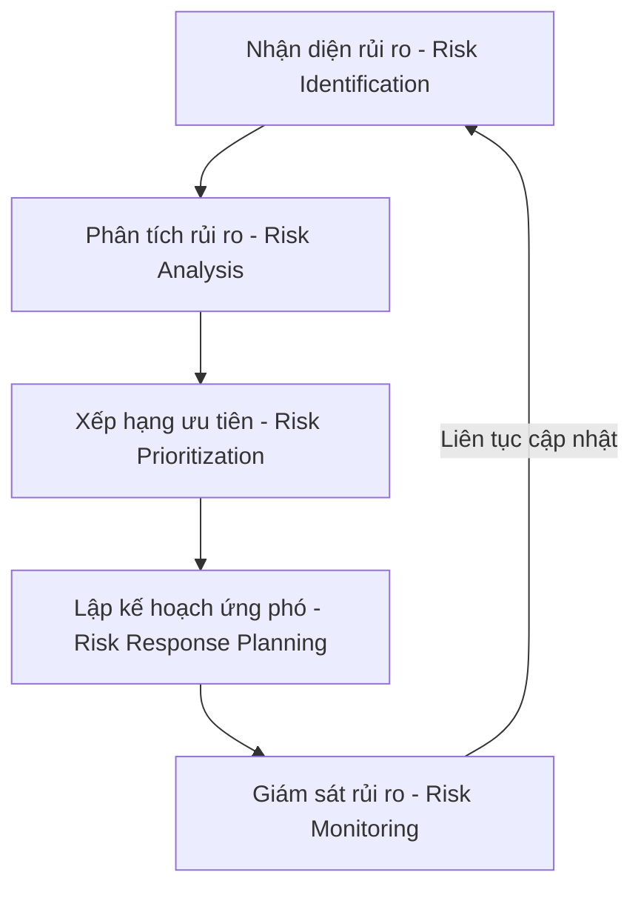
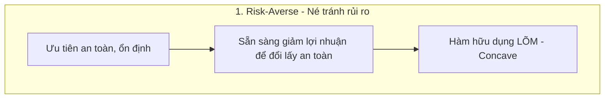
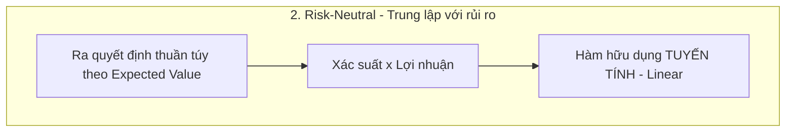
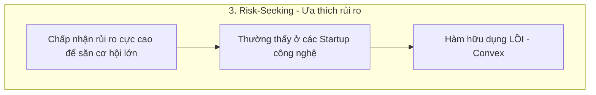

# NỘI DUNG CHI TIẾT CHUYÊN ĐỀ SEMINAR (PHẦN 1)
**Đề tài:** Risk and Schedule Management & Risk Utility Theory
**Môn học:** Quản trị Dự án Phần mềm (SW403DE01) - HK23.1A
**Nhóm thực hiện:** Nhóm 3 (Đại học Hoa Sen - HSU)

---

## 📅 BỐ CỤC CHƯƠNG TRÌNH SEMINAR (AGENDA)

1. **Giới thiệu:** Khái niệm Quản trị Rủi ro (Software Risk Management)
2. **Quy trình quản trị rủi ro:** 6 bước theo tiêu chuẩn PMBOK
3. **Rủi ro thị trường (Market Risks):** Yêu cầu khách hàng, đối thủ cạnh tranh, công nghệ mới
4. **Rủi ro tài chính (Financial Risks):** Thiếu hụt ngân sách, vượt chi phí, biến động tỷ giá
5. **Rủi ro công nghệ (Technical Risks):** Chọn sai công nghệ, lỗi bảo mật, khả năng mở rộng, nợ kỹ thuật (Technical Debt)
6. **Rủi ro con người (People Risks):** Thiếu nhân lực, nghỉ việc, thiếu kỹ năng, giao tiếp kém
7. **So sánh các loại rủi ro & Ma trận xác suất - tác động (Risk Matrix)**
8. **Lập kế hoạch ứng phó (Risk Response Planning):** Tránh (Avoid), Giảm thiểu (Mitigate), Chuyển giao (Transfer), Chấp nhận (Accept)
9. **Lý thuyết hữu dụng rủi ro (Risk Utility Theory):** Risk-Averse, Risk-Neutral, Risk-Seeking
10. **Ví dụ áp dụng thực tế & Case Study (JWD Consulting & các dự án lớn)**
11. **Tổng kết bài học & Khuyến nghị (Conclusion & Recommendations)**
12. **Hỏi & Đáp (Q&A)**

---

## 🎙️ PHÂN CÔNG VÀ NỘI DUNG CHI TIẾT TỪNG THÀNH VIÊN

---

### PART 1: TỔNG QUAN & RỦI RO THỊ TRƯỜNG, TÀI CHÍNH
👤 **Người trình bày:** Võ Duy Bình (Nhóm trưởng)
📊 *Số lượng slide dự kiến:* 8–10 slides

#### 1. Giới thiệu về quản trị rủi ro trong dự án phần mềm
*   **Định nghĩa:** Quản trị rủi ro (Risk Management) là quá trình xác định, phân tích, đánh giá, lập kế hoạch ứng phó và giám sát các rủi ro có thể xảy ra trong suốt vòng đời dự án.
*   **Mục tiêu cốt lõi:**
    *   Giảm thiểu xác suất xảy ra của các sự kiện tiêu cực.
    *   Giảm thiểu mức độ thiệt hại (tác động) nếu rủi ro xảy ra.
    *   Tăng cơ hội hoàn thành dự án đúng hạn (Schedule), đúng ngân sách (Cost) và đạt chất lượng kỳ vọng (Quality).
    *   *Theo PMBOK (Project Management Body of Knowledge), quản trị rủi ro là một trong những lĩnh vực kiến thức then chốt nhất.*
*   **Tại sao dự án phần mềm dễ gặp rủi ro?**
    *   Khác với các ngành xây dựng hay sản xuất truyền thống, phần mềm có đặc thù:
        *   Yêu cầu khách hàng thường xuyên thay đổi (Scope creep).
        *   Công nghệ phát triển quá nhanh (Lỗi thời kỹ thuật).
        *   Phụ thuộc rất lớn vào năng lực và tính sáng tạo của con người.
        *   Khó khăn lớn trong việc ước lượng chính xác nỗ lực, thời gian và chi phí.
    *   Tỷ lệ dự án CNTT bị chậm tiến độ, vượt ngân sách hoặc thất bại hoàn toàn vẫn còn rất cao trên thế giới. Do đó, quản trị rủi ro phải được thực hiện **chủ động (proactive)** ngay từ giai đoạn khởi tạo, chứ không phải đợi đến khi sự cố xảy ra mới đối phó.

#### 2. Khái niệm rủi ro & Cách đo lường
*   **Định nghĩa:** Rủi ro (Risk) là một sự kiện hoặc điều kiện chưa chắc chắn, nếu xảy ra sẽ ảnh hưởng (tích cực hoặc tiêu cực) đến mục tiêu dự án. Trong quản trị dự án, chúng ta tập trung chủ yếu vào rủi ro tiêu cực (Threats).
*   **Hai thành phần của rủi ro:**
    $$\text{Risk Score (Điểm rủi ro)} = \text{Probability (Xác suất xảy ra)} \times \text{Impact (Mức độ tác động)}$$
    *   Điểm rủi ro càng lớn thì mức độ ưu tiên xử lý rủi ro đó càng cao.

| Rủi ro cụ thể | Xác suất (Probability) | Ảnh hưởng (Impact) | Mức độ ưu tiên |
| :--- | :---: | :---: | :---: |
| **Khách hàng thay đổi yêu cầu** | Cao | Cao | **Cực kỳ cao** |
| **Server hệ thống bị cháy/sập** | Thấp | Rất cao | **Trung bình - Cao** |
| **Nhân sự chủ chốt nghỉ việc** | Trung bình | Cao | **Cao** |

#### 3. Quy trình quản trị rủi ro (6 bước chuẩn PMBOK)
1.  **Lập kế hoạch quản trị rủi ro:** Xác định phương pháp, công cụ, vai trò và ngân sách dự phòng cho rủi ro.
2.  **Nhận diện rủi ro:** Sử dụng brainstorm, phỏng vấn chuyên gia, phân tích SWOT, checklist và bài học dự án trước để lập ra **Sổ theo dõi rủi ro (Risk Register)**.
3.  **Phân tích rủi ro:**
    *   *Phân tích định tính (Qualitative):* Đánh giá và xếp hạng rủi ro theo mức Cao/Trung bình/Thấp.
    *   *Phân tích định lượng (Quantitative):* Tính toán giá trị tiền tệ kỳ vọng (Expected Monetary Value - EMV).
        *   *Ví dụ:* Xác suất rủi ro xảy ra là $70\%$, thiệt hại ước tính là 500 triệu đồng $\Rightarrow EMV = 0.7 \times 500 = 350$ triệu đồng.
4.  **Lập kế hoạch ứng phó:** Chuẩn bị các chiến lược xử lý rủi ro.
5.  **Thực hiện kế hoạch ứng phó:** Thực thi các biện pháp phòng ngừa hoặc khắc phục đã đề ra.
6.  **Theo dõi và kiểm soát:** Giám sát liên tục vì rủi ro luôn thay đổi trạng thái theo thời gian.

#### 4. Rủi ro thị trường (Market Risks)
> Rủi ro đến từ môi trường kinh doanh bên ngoài làm thay đổi tính hiệu quả hoặc mục tiêu của sản phẩm.

*   **4.1 Thay đổi nhu cầu khách hàng (Phổ biến nhất):**
    *   *Ví dụ:* Ban đầu yêu cầu web bán hàng cơ bản, sau 2 tháng yêu cầu tích hợp thêm AI Chatbot, thanh toán qua mã QR, livestream bán hàng và ví điện tử.
    *   *Hậu quả:* Trễ thời gian, đội chi phí, phá vỡ cấu trúc thiết kế hệ thống ban đầu.
    *   *Ứng phó:* Áp dụng quy trình Agile/Scrum, xây dựng bản mẫu nhanh (Prototype), họp nghiệm thu sprint định kỳ, và quản lý quy trình yêu cầu thay đổi (Change Request) chặt chẽ.
*   **4.2 Đối thủ cạnh tranh phát hành sản phẩm trước:**
    *   *Ví dụ:* Đang xây dựng app giao đồ ăn thì đối thủ tung ra tính năng định vị AI giao hàng trong 15 phút, khiến sản phẩm của mình bị lỗi thời trước khi ra mắt.
    *   *Ứng phó:* Liên tục khảo sát thị trường, phát triển phiên bản tối giản (MVP) để tung ra thị trường sớm nhằm chiếm lĩnh thị phần, tiếp thu phản hồi cải tiến sau.
*   **4.3 Thay đổi công nghệ nhanh chóng:**
    *   *Ví dụ:* Dự án chọn React 18, giữa chừng React 20 ra mắt với nhiều thay đổi đột phá, hoặc các công nghệ AI thay đổi hoàn toàn cách người dùng tương tác.
    *   *Ứng phó:* Lựa chọn các công nghệ ổn định (LTS), thiết kế kiến trúc hệ thống mở (mô-đun) để dễ nâng cấp, thường xuyên đào tạo công nghệ cho đội ngũ.

#### 5. Rủi ro tài chính (Financial Risks)
> Rủi ro ảnh hưởng trực tiếp đến ngân sách và dòng tiền duy trì dự án.

*   **5.1 Thiếu hụt ngân sách:**
    *   *Nguyên nhân:* Nhà đầu tư cắt giảm vốn đột ngột, khách hàng chậm thanh toán các cột mốc dự án, hoặc ước lượng chi phí ban đầu quá thấp.
    *   *Hậu quả:* Buộc phải cắt giảm nhân sự, giảm chất lượng kiểm thử, hoặc tệ nhất là đình chỉ dự án.
    *   *Ứng phó:* Thiết lập quỹ dự phòng tài chính rủi ro ($10\% - 20\%$), theo dõi sát sao dòng tiền, báo cáo tài chính định kỳ.
*   **5.2 Vượt chi phí phát triển (Cost Overruns):**
    *   *Nguyên nhân:* Phải làm lại (rework) nhiều do thiết kế sai, kéo dài thời gian phát triển dẫn đến tăng tiền lương, phát sinh chi phí thiết bị phát triển.
    *   *Ví dụ:* Ngân sách dự kiến 2 tỷ, thực tế chi trả lên đến 3 tỷ (vượt $50\%$).
    *   *Ứng phó:* Quản lý phạm vi dự án (Scope management) chặt chẽ để tránh Scope Creep, kiểm soát chặt chẽ các yêu cầu thay đổi, áp dụng phương pháp quản trị giá trị thu được (Earned Value Management - EVM).
*   **5.3 Biến động tỷ giá & Lạm phát:**
    *   *Đặc thù:* Gặp nhiều trong các dự án làm với đối tác nước ngoài hoặc sử dụng dịch vụ cloud quốc tế (AWS, Azure, OpenAI API thanh toán bằng USD).
    *   *Hậu quả:* Tỷ giá USD tăng mạnh làm tăng vọt chi phí vận hành hạ tầng; lạm phát làm tăng chi phí thuê văn phòng, lương nhân viên và thiết bị.
    *   *Ứng phó:* Ký hợp đồng dài hạn để khóa giá dịch vụ, chia nhỏ thanh toán theo giai đoạn, thiết lập điều khoản trượt giá trong hợp đồng.

#### 6. Ví dụ thực tế về rủi ro thị trường và tài chính
*   **Case 1: Thất bại của Nokia (Rủi ro thị trường & công nghệ):**
    *   Từng thống trị thị trường điện thoại toàn cầu, nhưng Nokia đánh giá thấp sự trỗi dậy của màn hình cảm ứng và hệ điều hành iOS/Android. Việc phản ứng chậm chạp và bảo thủ giữ lại hệ điều hành Symbian/MeeGo đã khiến Nokia hoàn toàn mất thị phần, buộc phải bán mảng di động cho Microsoft.
*   **Case 2: Thảm họa ra mắt trang web Healthcare.gov của Mỹ (Rủi ro tài chính & quản lý):**
    *   Trang web bảo hiểm y tế quốc gia ra mắt năm 2013 bị vượt ngân sách lên tới hàng trăm triệu USD, lỗi bảo mật nghiêm trọng và liên tục sập do quá tải ngay khi chạy thử. Nguyên nhân do thay đổi yêu cầu quá muộn, quản lý nhà thầu kém và thiếu kiểm thử rủi ro tích hợp.

---

### PART 2: RỦI RO CÔNG NGHỆ & CON NGƯỜI
👤 **Người trình bày:** Nguyễn Thanh Quang
📊 *Số lượng slide dự kiến:* 8–10 slides

#### 1. Rủi ro công nghệ (Technical Risks)
> Lựa chọn công nghệ và kiến trúc kỹ thuật sai lầm là nguyên nhân hàng đầu dẫn đến thất bại của dự án phần mềm.

*   **1.1 Chọn sai công nghệ (Chạy theo xu hướng - Hype):**
    *   *Nguyên nhân:* Nhóm phát triển chọn ngôn ngữ/framework mới nổi chỉ vì nó đang "hot" mà không đánh giá độ trưởng thành, tài liệu hướng dẫn và cộng đồng hỗ trợ. Hoặc đội ngũ hoàn toàn chưa có kinh nghiệm thực chiến với công nghệ đó.
    *   *Hậu quả:* Lập trình viên mất quá nhiều thời gian tự mày mò sửa lỗi hệ thống, viết sai cấu trúc, mã nguồn không tối ưu dẫn đến hiệu năng kém.
    *   *Ứng phó:* Thực hiện các bài kiểm tra thực tế nhỏ (Proof of Concept - PoC) hoặc xây dựng bản mẫu (Prototype) trước khi quyết định chọn công nghệ chủ chốt. Đánh giá dựa trên độ ổn định (LTS) và năng lực thực tế của đội ngũ.
*   **1.2 Lỗi bảo mật hệ thống (Security Flaws):**
    *   *Thực trạng:* Theo báo cáo cập nhật **OWASP Top 10:2025** (tổng hợp từ 2.8 triệu ứng dụng thực tế), rủi ro bảo mật lớn nhất hiện nay là **Kiểm soát truy cập lỗi (Broken Access Control)** chiếm $3.73\%$, theo sau là **Cấu hình sai bảo mật (Security Misconfiguration)**. Bản cập nhật mới cũng bổ sung rủi ro về **Lỗi chuỗi cung ứng phần mềm (Software Supply Chain Failures)** thông qua các thư viện bên thứ ba bị cài mã độc.
    *   *Ứng phó:* Áp dụng nguyên tắc bảo mật sớm **"Shift-Left Security"** (tích hợp công cụ quét mã lỗi bảo mật tự động ngay khi viết code, thực hiện Threat Modeling trước khi code, không đợi đến khi deploy mới kiểm thử bảo mật).
*   **1.3 Hệ thống không có khả năng mở rộng (Scalability Failure):**
    *   *Nguyên nhân:* Kiến trúc hệ thống thiết kế dạng monolithic cồng kềnh, không phân tách các dịch vụ, database không được tối ưu hoặc phân mảnh tốt.
    *   *Hậu quả:* Hệ thống chạy mượt khi có vài chục người test, nhưng bị nghẽn cổ chai và sập hoàn toàn khi đưa ra sử dụng thực tế với hàng chục ngàn người truy cập cùng lúc. Việc sửa lỗi lúc này đòi hỏi phải đập đi xây dựng lại kiến trúc, cực kỳ tốn kém.
    *   *Ứng phó (Theo IBM Well-Architected Framework):* Thiết kế các thành phần phi trạng thái (stateless), áp dụng loose coupling (cohesion cao, coupling thấp) như microservices, ưu tiên khả năng mở rộng ngang (scale-out) bằng cách thêm server thay vì nâng cấp phần cứng một server duy nhất (scale-up).
*   **1.4 Nợ kỹ thuật (Technical Debt):**
    *   *Khái niệm (Theo SEI - Carnegie Mellon):* Là những quyết định thỏa hiệp ngắn hạn (viết code ẩu, bỏ qua viết tài liệu kỹ thuật, bỏ qua viết unit test) để kịp deadline. Nợ kỹ thuật giống như khoản nợ tài chính, nếu không trả sớm, "lãi suất" (thời gian sửa lỗi và bảo trì sau này) sẽ tăng vọt làm tê liệt khả năng phát triển các tính năng mới của phần mềm.
    *   *Ứng phó:* Làm cho nợ kỹ thuật trở nên trực quan (phải ghi nhận lại các đoạn code xấu cần refactor vào backlog), phân bổ khoảng $15\% - 20\%$ thời gian của mỗi sprint để refactor code và trả nợ kỹ thuật một cách chủ động.

#### 2. Rủi ro con người (Human & Resource Risks)
> Con người là nhân tố trực tiếp tạo ra phần mềm, rủi ro con người là rủi ro khó kiểm soát nhất.

*   **2.1 Thiếu hụt nguồn nhân lực dự án:**
    *   *Thực trạng:* Theo báo cáo **Global Project Management Talent Gap (2025)** của PMI, thế giới đang thiếu hụt trầm trọng nhân sự quản trị dự án và lập trình viên lành nghề. Việc khởi động dự án mới mà không đánh giá đúng nguồn lực rảnh rỗi trong tổ chức là nguyên nhân chính dẫn đến quá tải.
    *   *Ứng phó:* Lập kế hoạch phân bổ nguồn lực dựa trên dữ liệu thực tế, cân đối khối lượng công việc, xây dựng lộ trình nâng cao năng lực (upskilling/reskilling).
*   **2.2 Nhân sự chủ chốt nghỉ việc đột ngột (Key-Person Risk):**
    *   *Hậu quả:* Theo thư viện PERIL (PMI), việc mất một nhân sự nắm giữ toàn bộ kiến trúc lõi của dự án phần mềm có thể làm thời gian thực hiện phần việc đó tăng lên **gấp ba lần**, gây đình trệ tiến độ nghiêm trọng vì phải tuyển dụng và đào tạo lại từ đầu.
    *   *Ứng phó:* Thực hiện chia sẻ kiến thức liên tục trong đội ngũ (Pair Programming, Code Review chéo), viết tài liệu kỹ thuật đầy đủ, không để một người nắm giữ độc quyền một mảng kiến thức kỹ thuật quan trọng của dự án.
*   **2.3 Giao tiếp kém hiệu quả trong đội ngũ:**
    *   *Thực trạng:* Theo báo cáo **Pulse of the Profession** của PMI, giao tiếp kém là nguyên nhân trực tiếp dẫn đến thất bại của **1/3 dự án**. Trung bình cứ mỗi 1 tỷ USD đầu tư, có 75 triệu USD bị lãng phí do giao tiếp không hiệu quả giữa các bên (đội dev, PM, khách hàng).
    *   *Ứng phó:* Thiết lập cơ chế giao tiếp rõ ràng ngay từ đầu (RACI Matrix định rõ ai chịu trách nhiệm làm gì, họp Daily Standup ngắn hàng ngày để nắm bắt vướng mắc, sử dụng công cụ quản lý tập trung như Jira, Trello, Slack).

#### 3. Bảng đánh giá và ví dụ thực tế về rủi ro Công nghệ & Con người

##### Bảng phân tích rủi ro Công nghệ & Con người:

| Loại rủi ro | Tần suất xảy ra | Tác động thực tế | Hậu quả chính |
| :--- | :---: | :---: | :--- |
| **Lỗi bảo mật** | Rất cao | Nghiêm trọng | Rò rỉ thông tin dữ liệu khách hàng, thiệt hại uy tín và pháp lý. |
| **Hệ thống nghẽn tải** | Cao | Cao | Sập ứng dụng khi lượng truy cập thực tế tăng cao. |
| **Nợ kỹ thuật** | Cực kỳ cao | Trung bình - Dài hạn | Code càng ngày càng rối, không thể phát triển thêm tính năng mới. |
| **Giao tiếp kém** | Rất cao | Cao | Hiểu sai yêu cầu khách hàng, bàn giao sản phẩm sai thiết kế. |

##### Các ví dụ thực tế điển hình:
*   **Vấn đề bảo mật (Vụ rò rỉ dữ liệu Equifax 2017):**
    *   Do không cập nhật bản vá bảo mật cho lỗ hổng đã được cảnh báo của framework Apache Struts, Equifax đã bị tin tặc tấn công làm rò rỉ thông tin cá nhân cực kỳ nhạy cảm của 147 triệu khách hàng, thiệt hại tài chính khổng lồ và khiến giám đốc điều hành phải từ chức.
*   **Vấn đề nợ kỹ thuật (Knight Capital Group 2012):**
    *   Do lười xóa bỏ đoạn code lỗi thời đã ngừng hoạt động từ lâu (nợ kỹ thuật tích lũy), khi triển khai bản cập nhật mới, đoạn code cũ này bị kích hoạt nhầm trên một server, thực hiện giao dịch chứng khoán điên cuồng làm công ty lỗ **440 triệu USD chỉ trong 45 phút** và phá sản ngay sau đó.
*   **FBI - Virtual Case File (Thất bại do rủi ro con người & giao tiếp):**
    *   Dự án quản lý hồ sơ vụ án trị giá 170 triệu USD của FBI bị hủy bỏ hoàn toàn sau 5 năm phát triển do thay đổi yêu cầu liên tục, thiếu kỹ năng quản lý công nghệ của đội ngũ FBI và giao tiếp vô cùng kém với nhà thầu phát triển.

---

### PART 3: KẾ HOẠCH ỨNG PHÓ & RISK UTILITY THEORY
👤 **Người trình bày:** Trần Bá Lợi & Hồng Bảo Khang
📊 *Số lượng slide dự kiến:* 10 slides

#### 1. Lập kế hoạch ứng phó rủi ro (Risk Response Planning)
> Lập kế hoạch ứng phó là việc đưa ra các quyết định hành động cụ thể để tối ưu hóa cơ hội và giảm thiểu mối đe dọa đối với mục tiêu dự án.

##### Quy trình quản trị rủi ro vòng lặp:


##### 4 Chiến lược ứng phó rủi ro chính:
1.  **Avoid (Né tránh):** Thay đổi kế hoạch dự án để loại bỏ hoàn toàn khả năng xảy ra rủi ro.
    *   *Ví dụ:* Không sử dụng một thư viện beta chưa ổn định mà chuyển sang dùng thư viện LTS quen thuộc để tránh lỗi hệ thống.
2.  **Mitigate (Giảm thiểu):** Thực hiện các hành động nhằm làm giảm xác suất hoặc mức độ ảnh hưởng của rủi ro.
    *   *Ví dụ:* Thực hiện viết unit test tự động và kiểm thử liên tục để giảm thiểu lỗi logic khi bàn giao.
3.  **Transfer (Chuyển giao):** Chuyển dịch trách nhiệm gánh chịu hậu quả rủi ro sang một bên thứ ba.
    *   *Ví dụ:* Mua bảo hiểm dự án phần mềm, ký hợp đồng outsource mảng bảo mật cho công ty chuyên nghiệp.
4.  **Accept (Chấp nhận):** Chấp nhận rủi ro vì chi phí phòng ngừa quá cao so với thiệt hại, hoặc không có giải pháp khả thi nào khác. Chuẩn bị sẵn ngân sách dự phòng (Contingency reserve) để xử lý nếu nó xảy ra.
    *   *Ví dụ:* Chấp nhận rủi ro nhà mạng bị mất kết nối trong vài phút và chuẩn bị sẵn trang thông báo lỗi thân thiện.

##### Ví dụ ma trận ứng phó rủi ro thực tế trong dự án:

| Rủi ro | Xác suất | Tác động | Chiến lược | Kế hoạch hành động cụ thể |
| :--- | :---: | :---: | :---: | :--- |
| **Thiếu nhân sự** | Cao | Cao | **Mitigate** | Xây dựng quy trình chia sẻ kiến thức chéo, tuyển dụng thực tập sinh dự phòng. |
| **Hạ tầng sập** | Thấp | Cao | **Transfer** | Thuê dịch vụ Cloud uy tín (AWS/Azure) cam kết SLA 99.99%. |
| **Yêu cầu thay đổi** | Cao | Trung bình | **Mitigate/Accept** | Quy định rõ quy trình xử lý yêu cầu thay đổi (Change Request) và tính phí phát sinh. |

#### 2. Lý thuyết hữu dụng rủi ro (Risk Utility Theory)
*   **Khái niệm:** Đo lường mức độ hài lòng hoặc giá trị chủ quan (**Utility - Độ hữu dụng**) mà một cá nhân hoặc tổ chức cảm nhận được đối với các kết quả tài chính/dự án không chắc chắn. 
*   **Bản chất:** Utility không tăng tuyến tính theo tiền bạc. Một khoản lãi hay lỗ có ý nghĩa hoàn toàn khác nhau đối với các tổ chức có quy mô khác nhau.
    *   *Ví dụ:* Khoản đầu tư mạo hiểm trị giá 500 triệu đồng có thể làm một startup phá sản nếu thất bại, nhưng đối với một tập đoàn công nghệ lớn, đó chỉ là chi phí thử nghiệm thông thường.

##### Ba nhóm thái độ đối với rủi ro:

```carousel

<!-- slide -->

<!-- slide -->

```

##### Bảng so sánh chi tiết thái độ rủi ro:

| Tiêu chí so sánh | Risk-Averse (Né tránh) | Risk-Neutral (Trung lập) | Risk-Seeking (Mạo hiểm) |
| :--- | :--- | :--- | :--- |
| **Khẩu vị rủi ro** | Rất thấp, ưu tiên an toàn tối đa. | Dựa hoàn toàn trên con số tính toán kỳ vọng kinh tế. | Chấp nhận đánh cược lớn để đạt đột phá lớn. |
| **Dạng đường cong Utility** | **Lõm (Concave)** (Hữu dụng cận biên giảm dần). | **Đường thẳng (Linear)**. | **Lồi (Convex)** (Hữu dụng cận biên tăng dần). |
| **Cách chọn công nghệ** | Chọn công nghệ phổ biến, lâu đời, ổn định (như Java/Spring Boot). | Chọn công nghệ tối ưu nhất về mặt chi phí và hiệu quả ước lượng. | Chọn các công nghệ mới nhất (AI Agents, Blockchain) để tạo đột phá cạnh tranh. |
| **Đối tượng điển hình** | Ngân hàng, Cơ quan chính phủ, Dự án y tế/an ninh. | Các doanh nghiệp phần mềm quy mô lớn đã trưởng thành. | Các dự án Startup, công ty nghiên cứu công nghệ mới (R&D). |

---

### PART 4: KẾT LUẬN & KHUYẾN NGHỊ (CONCLUSION & RECOMMENDATIONS)
📊 *Số lượng slide dự kiến:* 1–2 slides

#### 1. Tổng kết chuyên đề
*   Quản trị rủi ro không phải là hoạt động làm một lần rồi thôi, mà là một quy trình lặp đi lặp lại liên tục trong suốt vòng đời dự án phần mềm.
*   Dự án phần mềm luôn bị bủa vây bởi 4 nhóm rủi ro lớn: **Thị trường, Tài chính, Công nghệ, và Con người**.
*   Các chiến lược ứng phó (Avoid, Mitigate, Transfer, Accept) là công cụ thực thi, nhưng **Lý thuyết hữu dụng (Risk Utility Theory)** mới là chìa khóa giải thích cách thức các tổ chức lựa chọn chiến lược phù hợp dựa trên quy mô tài chính và khẩu vị rủi ro thực tế của họ.

#### 2. Bài học kinh nghiệm & Khuyến nghị
1.  **Chủ động nhận diện sớm:** Phải xây dựng **Risk Register** ngay khi khởi động dự án và cập nhật định kỳ hàng tuần/hàng tháng.
2.  **Đánh giá khẩu vị rủi ro trước khi ra quyết định:** PM cần hiểu rõ khách hàng và tổ chức của mình thuộc nhóm thái độ rủi ro nào để đưa ra các giải pháp ứng phó kỹ thuật và công nghệ phù hợp (tránh đề xuất công nghệ quá mới mẻ cho một đối tác Risk-Averse).
3.  **Tập trung vào Giao tiếp và Dự phòng:** Duy trì giao tiếp minh bạch giữa khách hàng và đội ngũ phát triển, thiết lập ngân sách và thời gian dự phòng hợp lý để tránh rơi vào tình thế bị động khi rủi ro xảy ra.

---
🔗 **Tài liệu tham khảo chuyên sâu:**
*   [Software Risk Management Guide & Academic Slides](https://docs.google.com/document/d/1jVo4H3byKjc0_Kevj1n7zIfBiea_NKaP/edit?usp=sharing&ouid=116767004171268388413&rtpof=true&sd=true)
*   PMBOK Guide 7th Edition - Chapter on Risk Management
*   OWASP Top 10:2025 Security Vulnerability Data Report
